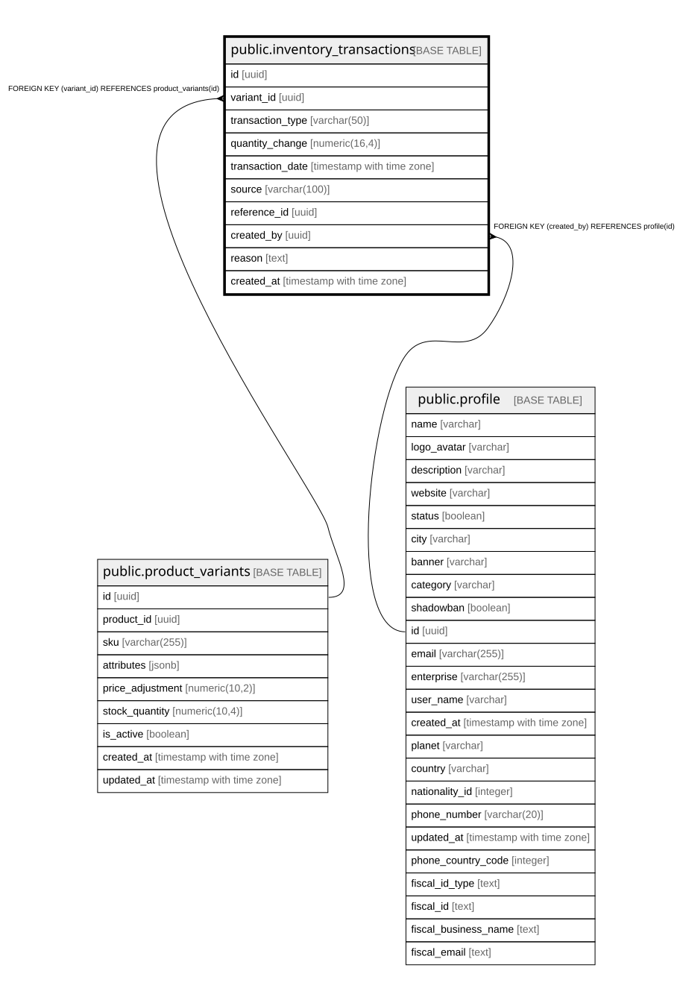

# public.inventory_transactions

## Columns

| Name | Type | Default | Nullable | Children | Parents | Comment |
| ---- | ---- | ------- | -------- | -------- | ------- | ------- |
| id | uuid | gen_random_uuid() | false |  |  |  |
| variant_id | uuid |  | false |  | [public.product_variants](public.product_variants.md) |  |
| transaction_type | varchar(50) |  | false |  |  |  |
| quantity_change | numeric(16,4) |  | false |  |  | Change in inventory quantity. Can be positive (received) or negative (used). NUMERIC(10,4) for precise tracking. |
| transaction_date | timestamp with time zone | now() | false |  |  |  |
| source | varchar(100) |  | false |  |  |  |
| reference_id | uuid |  | true |  |  |  |
| created_by | uuid |  | true |  | [public.profile](public.profile.md) |  |
| reason | text |  | true |  |  |  |
| created_at | timestamp with time zone | now() | false |  |  |  |

## Constraints

| Name | Type | Definition |
| ---- | ---- | ---------- |
| inventory_transactions_pkey | PRIMARY KEY | PRIMARY KEY (id) |
| inventory_transactions_variant_id_fkey | FOREIGN KEY | FOREIGN KEY (variant_id) REFERENCES product_variants(id) |
| inventory_transactions_created_by_fkey | FOREIGN KEY | FOREIGN KEY (created_by) REFERENCES profile(id) |

## Indexes

| Name | Definition |
| ---- | ---------- |
| inventory_transactions_pkey | CREATE UNIQUE INDEX inventory_transactions_pkey ON public.inventory_transactions USING btree (id) |
| idx_inventory_transactions_transaction_date | CREATE INDEX idx_inventory_transactions_transaction_date ON public.inventory_transactions USING btree (transaction_date) |
| idx_inventory_transactions_variant_id | CREATE INDEX idx_inventory_transactions_variant_id ON public.inventory_transactions USING btree (variant_id) |

## Relations

---

> Generated by [tbls](https://github.com/k1LoW/tbls)
