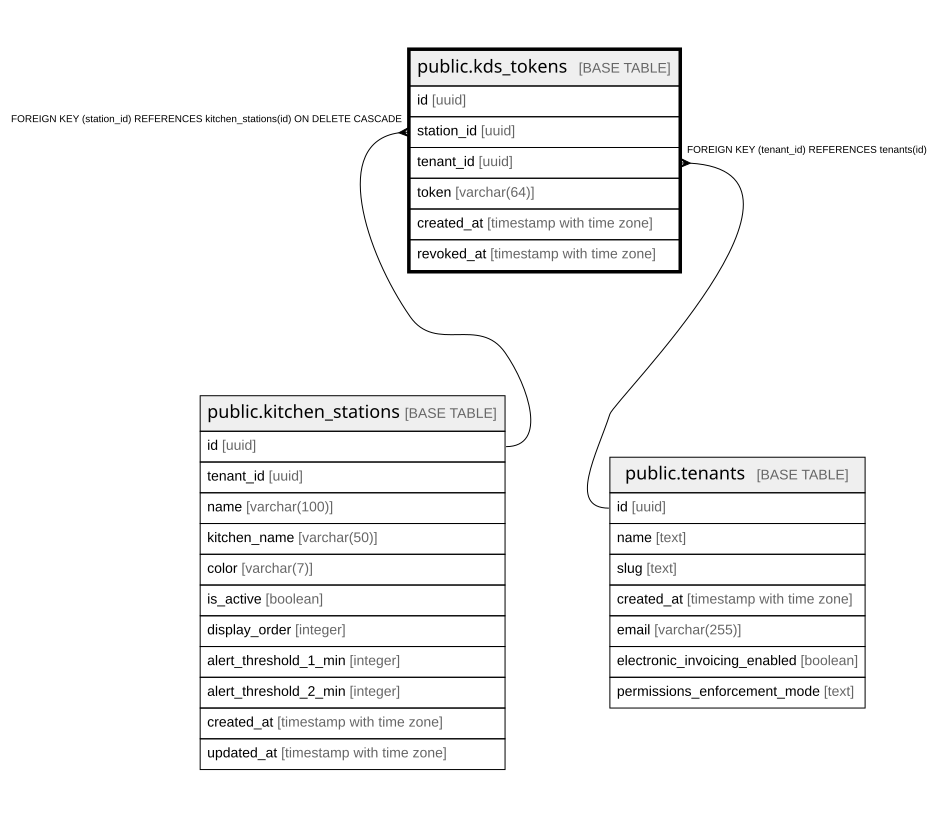

# public.kds_tokens

## Columns

| Name | Type | Default | Nullable | Children | Parents | Comment |
| ---- | ---- | ------- | -------- | -------- | ------- | ------- |
| id | uuid | gen_random_uuid() | false |  |  |  |
| station_id | uuid |  | false |  | [public.kitchen_stations](public.kitchen_stations.md) |  |
| tenant_id | uuid |  | false |  | [public.tenants](public.tenants.md) |  |
| token | varchar(64) |  | false |  |  |  |
| created_at | timestamp with time zone | now() | false |  |  |  |
| revoked_at | timestamp with time zone |  | true |  |  |  |

## Constraints

| Name | Type | Definition |
| ---- | ---- | ---------- |
| kds_tokens_tenant_id_fkey | FOREIGN KEY | FOREIGN KEY (tenant_id) REFERENCES tenants(id) |
| kds_tokens_station_id_fkey | FOREIGN KEY | FOREIGN KEY (station_id) REFERENCES kitchen_stations(id) ON DELETE CASCADE |
| kds_tokens_pkey | PRIMARY KEY | PRIMARY KEY (id) |
| kds_tokens_token_key | UNIQUE | UNIQUE (token) |

## Indexes

| Name | Definition |
| ---- | ---------- |
| kds_tokens_pkey | CREATE UNIQUE INDEX kds_tokens_pkey ON public.kds_tokens USING btree (id) |
| kds_tokens_token_key | CREATE UNIQUE INDEX kds_tokens_token_key ON public.kds_tokens USING btree (token) |
| idx_kds_tokens_active | CREATE INDEX idx_kds_tokens_active ON public.kds_tokens USING btree (token) WHERE (revoked_at IS NULL) |

## Relations

---

> Generated by [tbls](https://github.com/k1LoW/tbls)
