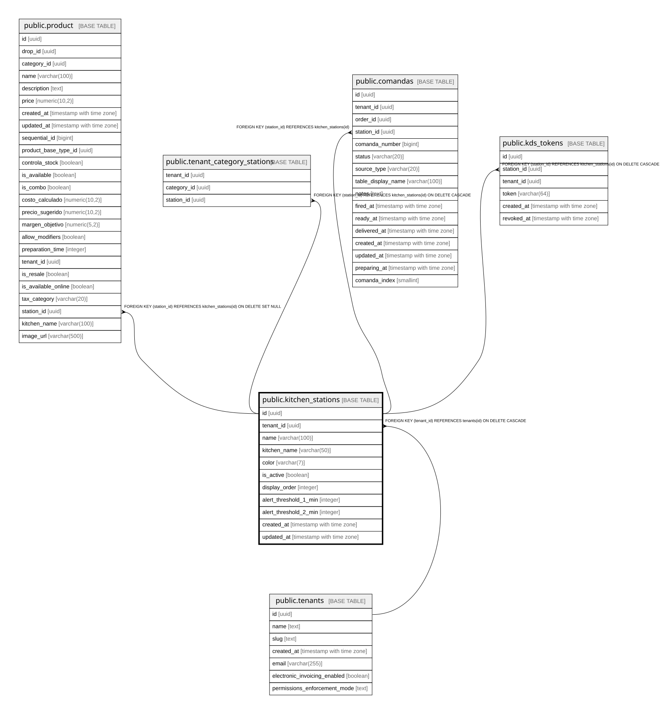

# public.kitchen_stations

## Columns

| Name | Type | Default | Nullable | Children | Parents | Comment |
| ---- | ---- | ------- | -------- | -------- | ------- | ------- |
| id | uuid | gen_random_uuid() | false | [public.product](public.product.md) [public.tenant_category_stations](public.tenant_category_stations.md) [public.comandas](public.comandas.md) [public.kds_tokens](public.kds_tokens.md) |  |  |
| tenant_id | uuid |  | false |  | [public.tenants](public.tenants.md) |  |
| name | varchar(100) |  | false |  |  |  |
| kitchen_name | varchar(50) |  | true |  |  |  |
| color | varchar(7) | '#6B7280'::character varying | false |  |  |  |
| is_active | boolean | true | false |  |  |  |
| display_order | integer | 0 | false |  |  |  |
| alert_threshold_1_min | integer | 8 | false |  |  |  |
| alert_threshold_2_min | integer | 15 | false |  |  |  |
| created_at | timestamp with time zone | now() | false |  |  |  |
| updated_at | timestamp with time zone | now() | false |  |  |  |

## Constraints

| Name | Type | Definition |
| ---- | ---- | ---------- |
| kitchen_stations_tenant_id_fkey | FOREIGN KEY | FOREIGN KEY (tenant_id) REFERENCES tenants(id) ON DELETE CASCADE |
| kitchen_stations_pkey | PRIMARY KEY | PRIMARY KEY (id) |

## Indexes

| Name | Definition |
| ---- | ---------- |
| kitchen_stations_pkey | CREATE UNIQUE INDEX kitchen_stations_pkey ON public.kitchen_stations USING btree (id) |
| idx_kitchen_stations_tenant | CREATE INDEX idx_kitchen_stations_tenant ON public.kitchen_stations USING btree (tenant_id) |
| idx_kitchen_stations_active | CREATE INDEX idx_kitchen_stations_active ON public.kitchen_stations USING btree (tenant_id, is_active) WHERE (is_active = true) |

## Relations

---

> Generated by [tbls](https://github.com/k1LoW/tbls)
