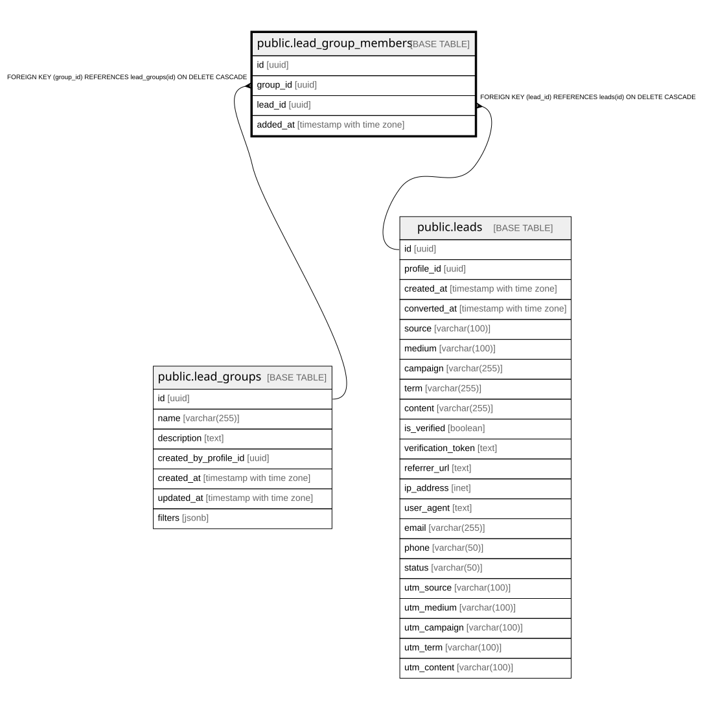

# public.lead_group_members

## Columns

| Name | Type | Default | Nullable | Children | Parents | Comment |
| ---- | ---- | ------- | -------- | -------- | ------- | ------- |
| id | uuid | gen_random_uuid() | false |  |  |  |
| group_id | uuid |  | false |  | [public.lead_groups](public.lead_groups.md) |  |
| lead_id | uuid |  | false |  | [public.leads](public.leads.md) |  |
| added_at | timestamp with time zone | now() | true |  |  |  |

## Constraints

| Name | Type | Definition |
| ---- | ---- | ---------- |
| lead_group_members_group_id_lead_id_key | UNIQUE | UNIQUE (group_id, lead_id) |
| lead_group_members_pkey | PRIMARY KEY | PRIMARY KEY (id) |
| lead_group_members_group_id_fkey | FOREIGN KEY | FOREIGN KEY (group_id) REFERENCES lead_groups(id) ON DELETE CASCADE |
| lead_group_members_lead_id_fkey | FOREIGN KEY | FOREIGN KEY (lead_id) REFERENCES leads(id) ON DELETE CASCADE |

## Indexes

| Name | Definition |
| ---- | ---------- |
| lead_group_members_group_id_lead_id_key | CREATE UNIQUE INDEX lead_group_members_group_id_lead_id_key ON public.lead_group_members USING btree (group_id, lead_id) |
| lead_group_members_pkey | CREATE UNIQUE INDEX lead_group_members_pkey ON public.lead_group_members USING btree (id) |
| idx_lead_group_members_group | CREATE INDEX idx_lead_group_members_group ON public.lead_group_members USING btree (group_id) |
| idx_lead_group_members_lead | CREATE INDEX idx_lead_group_members_lead ON public.lead_group_members USING btree (lead_id) |

## Relations

---

> Generated by [tbls](https://github.com/k1LoW/tbls)
