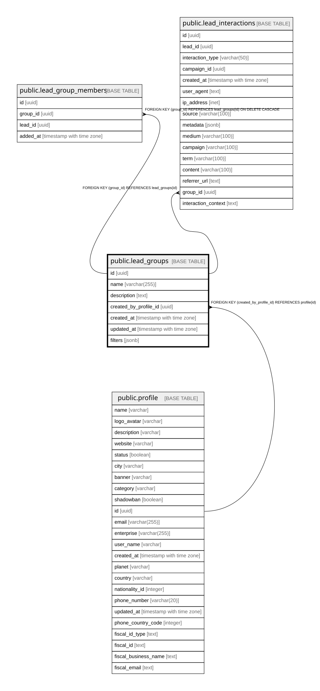

# public.lead_groups

## Columns

| Name | Type | Default | Nullable | Children | Parents | Comment |
| ---- | ---- | ------- | -------- | -------- | ------- | ------- |
| id | uuid | gen_random_uuid() | false | [public.lead_group_members](public.lead_group_members.md) [public.lead_interactions](public.lead_interactions.md) |  |  |
| name | varchar(255) |  | false |  |  |  |
| description | text |  | true |  |  |  |
| created_by_profile_id | uuid |  | false |  | [public.profile](public.profile.md) |  |
| created_at | timestamp with time zone | now() | true |  |  |  |
| updated_at | timestamp with time zone | now() | true |  |  |  |
| filters | jsonb |  | true |  |  |  |

## Constraints

| Name | Type | Definition |
| ---- | ---- | ---------- |
| lead_groups_pkey | PRIMARY KEY | PRIMARY KEY (id) |
| lead_groups_created_by_profile_id_fkey | FOREIGN KEY | FOREIGN KEY (created_by_profile_id) REFERENCES profile(id) |

## Indexes

| Name | Definition |
| ---- | ---------- |
| lead_groups_pkey | CREATE UNIQUE INDEX lead_groups_pkey ON public.lead_groups USING btree (id) |

## Relations

---

> Generated by [tbls](https://github.com/k1LoW/tbls)
