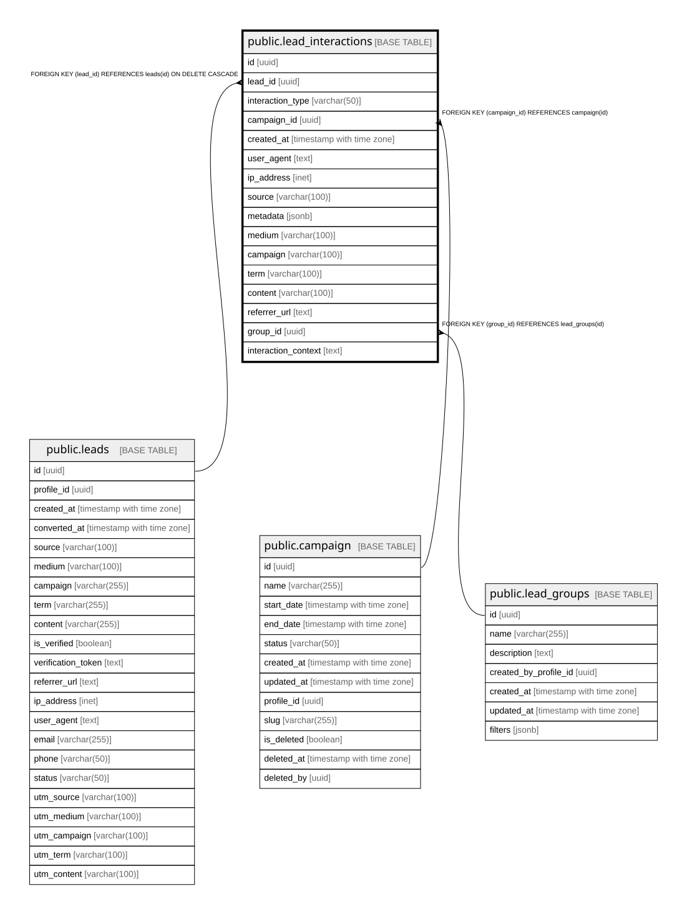

# public.lead_interactions

## Columns

| Name | Type | Default | Nullable | Children | Parents | Comment |
| ---- | ---- | ------- | -------- | -------- | ------- | ------- |
| id | uuid | gen_random_uuid() | false |  |  |  |
| lead_id | uuid |  | false |  | [public.leads](public.leads.md) |  |
| interaction_type | varchar(50) |  | false |  |  |  |
| campaign_id | uuid |  | true |  | [public.campaign](public.campaign.md) |  |
| created_at | timestamp with time zone | now() | true |  |  |  |
| user_agent | text |  | true |  |  |  |
| ip_address | inet |  | true |  |  |  |
| source | varchar(100) |  | true |  |  |  |
| metadata | jsonb |  | true |  |  |  |
| medium | varchar(100) |  | true |  |  |  |
| campaign | varchar(100) |  | true |  |  |  |
| term | varchar(100) |  | true |  |  |  |
| content | varchar(100) |  | true |  |  |  |
| referrer_url | text |  | true |  |  |  |
| group_id | uuid |  | true |  | [public.lead_groups](public.lead_groups.md) |  |
| interaction_context | text |  | true |  |  |  |

## Constraints

| Name | Type | Definition |
| ---- | ---- | ---------- |
| lead_interactions_campaign_id_fkey | FOREIGN KEY | FOREIGN KEY (campaign_id) REFERENCES campaign(id) |
| lead_interactions_group_id_fkey | FOREIGN KEY | FOREIGN KEY (group_id) REFERENCES lead_groups(id) |
| lead_interactions_pkey | PRIMARY KEY | PRIMARY KEY (id) |
| lead_interactions_lead_id_fkey | FOREIGN KEY | FOREIGN KEY (lead_id) REFERENCES leads(id) ON DELETE CASCADE |

## Indexes

| Name | Definition |
| ---- | ---------- |
| lead_interactions_pkey | CREATE UNIQUE INDEX lead_interactions_pkey ON public.lead_interactions USING btree (id) |
| idx_lead_interactions_campaign | CREATE INDEX idx_lead_interactions_campaign ON public.lead_interactions USING btree (campaign_id) |
| idx_lead_interactions_created_at | CREATE INDEX idx_lead_interactions_created_at ON public.lead_interactions USING btree (created_at) |
| idx_lead_interactions_lead_type | CREATE INDEX idx_lead_interactions_lead_type ON public.lead_interactions USING btree (lead_id, interaction_type) |
| idx_lead_interactions_source | CREATE INDEX idx_lead_interactions_source ON public.lead_interactions USING btree (source) |
| idx_lead_interactions_type | CREATE INDEX idx_lead_interactions_type ON public.lead_interactions USING btree (interaction_type) |
| idx_lead_interactions_type_lead_created | CREATE INDEX idx_lead_interactions_type_lead_created ON public.lead_interactions USING btree (interaction_type, lead_id, created_at) |

## Relations

---

> Generated by [tbls](https://github.com/k1LoW/tbls)
