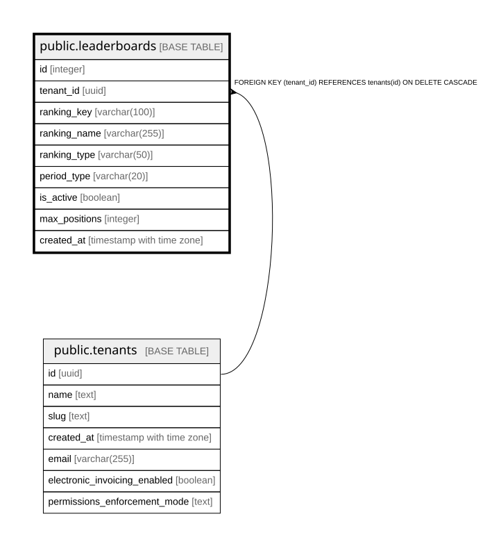

# public.leaderboards

## Columns

| Name | Type | Default | Nullable | Children | Parents | Comment |
| ---- | ---- | ------- | -------- | -------- | ------- | ------- |
| id | integer | nextval('leaderboards_id_seq'::regclass) | false |  |  |  |
| tenant_id | uuid |  | false |  | [public.tenants](public.tenants.md) |  |
| ranking_key | varchar(100) |  | false |  |  |  |
| ranking_name | varchar(255) |  | false |  |  |  |
| ranking_type | varchar(50) |  | false |  |  |  |
| period_type | varchar(20) |  | false |  |  |  |
| is_active | boolean | true | true |  |  |  |
| max_positions | integer | 20 | true |  |  |  |
| created_at | timestamp with time zone | now() | true |  |  |  |

## Constraints

| Name | Type | Definition |
| ---- | ---- | ---------- |
| leaderboards_pkey | PRIMARY KEY | PRIMARY KEY (id) |
| leaderboards_tenant_id_ranking_key_key | UNIQUE | UNIQUE (tenant_id, ranking_key) |
| leaderboards_tenant_id_fkey | FOREIGN KEY | FOREIGN KEY (tenant_id) REFERENCES tenants(id) ON DELETE CASCADE |

## Indexes

| Name | Definition |
| ---- | ---------- |
| leaderboards_pkey | CREATE UNIQUE INDEX leaderboards_pkey ON public.leaderboards USING btree (id) |
| leaderboards_tenant_id_ranking_key_key | CREATE UNIQUE INDEX leaderboards_tenant_id_ranking_key_key ON public.leaderboards USING btree (tenant_id, ranking_key) |

## Relations

---

> Generated by [tbls](https://github.com/k1LoW/tbls)
