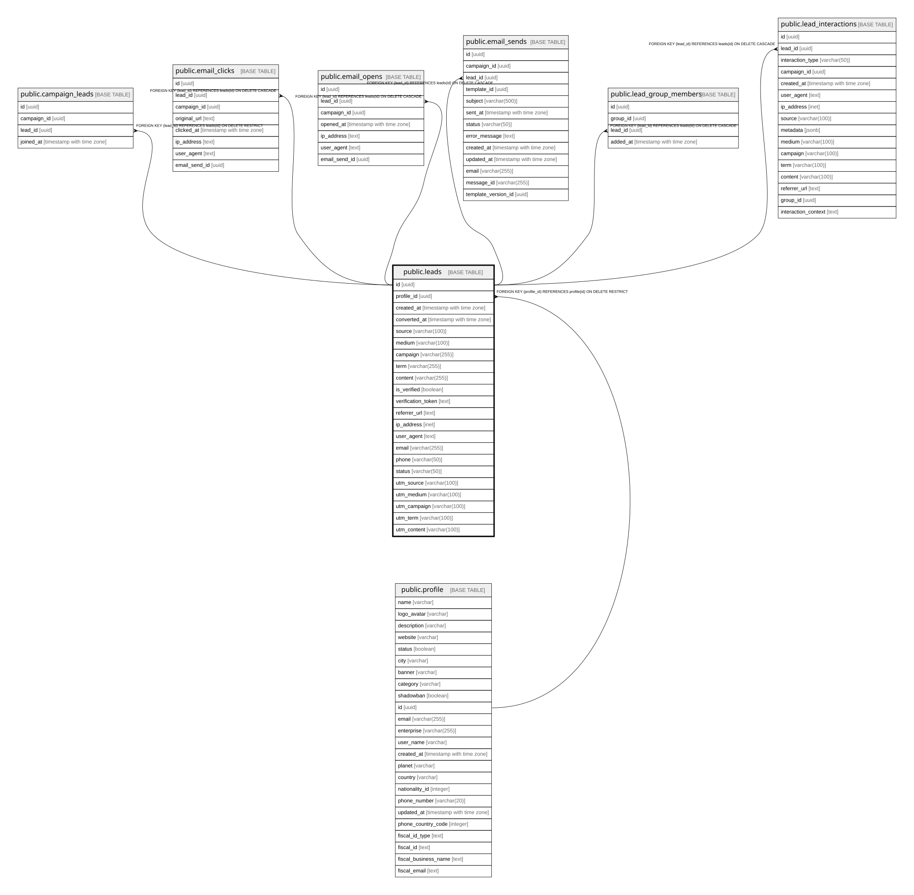

# public.leads

## Columns

| Name | Type | Default | Nullable | Children | Parents | Comment |
| ---- | ---- | ------- | -------- | -------- | ------- | ------- |
| id | uuid | gen_random_uuid() | false | [public.campaign_leads](public.campaign_leads.md) [public.email_clicks](public.email_clicks.md) [public.email_opens](public.email_opens.md) [public.email_sends](public.email_sends.md) [public.lead_group_members](public.lead_group_members.md) [public.lead_interactions](public.lead_interactions.md) |  |  |
| profile_id | uuid |  | false |  | [public.profile](public.profile.md) |  |
| created_at | timestamp with time zone | now() | false |  |  |  |
| converted_at | timestamp with time zone |  | true |  |  |  |
| source | varchar(100) |  | true |  |  |  |
| medium | varchar(100) |  | true |  |  |  |
| campaign | varchar(255) |  | true |  |  |  |
| term | varchar(255) |  | true |  |  |  |
| content | varchar(255) |  | true |  |  |  |
| is_verified | boolean | false | true |  |  |  |
| verification_token | text |  | true |  |  |  |
| referrer_url | text |  | true |  |  |  |
| ip_address | inet |  | true |  |  |  |
| user_agent | text |  | true |  |  |  |
| email | varchar(255) | 'unknown@example.com'::character varying | false |  |  |  |
| phone | varchar(50) | NULL::character varying | true |  |  |  |
| status | varchar(50) | 'active'::character varying | false |  |  |  |
| utm_source | varchar(100) | NULL::character varying | true |  |  |  |
| utm_medium | varchar(100) | NULL::character varying | true |  |  |  |
| utm_campaign | varchar(100) | NULL::character varying | true |  |  |  |
| utm_term | varchar(100) | NULL::character varying | true |  |  |  |
| utm_content | varchar(100) | NULL::character varying | true |  |  |  |

## Constraints

| Name | Type | Definition |
| ---- | ---- | ---------- |
| leads_pkey | PRIMARY KEY | PRIMARY KEY (id) |
| fk_profile | FOREIGN KEY | FOREIGN KEY (profile_id) REFERENCES profile(id) ON DELETE RESTRICT |

## Indexes

| Name | Definition |
| ---- | ---------- |
| leads_pkey | CREATE UNIQUE INDEX leads_pkey ON public.leads USING btree (id) |

## Relations

---

> Generated by [tbls](https://github.com/k1LoW/tbls)
