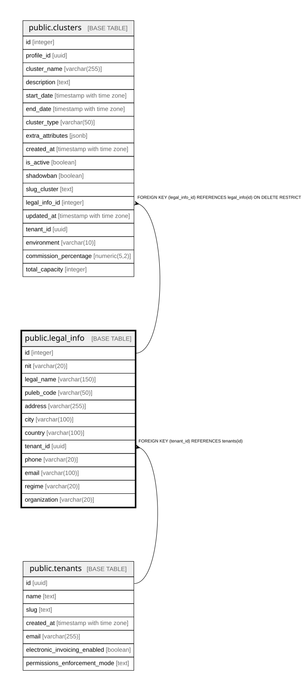

# public.legal_info

## Columns

| Name | Type | Default | Nullable | Children | Parents | Comment |
| ---- | ---- | ------- | -------- | -------- | ------- | ------- |
| id | integer | nextval('legal_info_id_seq'::regclass) | false | [public.clusters](public.clusters.md) |  |  |
| nit | varchar(20) |  | true |  |  |  |
| legal_name | varchar(150) |  | true |  |  |  |
| puleb_code | varchar(50) |  | true |  |  |  |
| address | varchar(255) |  | true |  |  |  |
| city | varchar(100) |  | true |  |  |  |
| country | varchar(100) |  | true |  |  |  |
| tenant_id | uuid |  | true |  | [public.tenants](public.tenants.md) |  |
| phone | varchar(20) |  | true |  |  |  |
| email | varchar(100) |  | true |  |  |  |
| regime | varchar(20) |  | true |  |  |  |
| organization | varchar(20) |  | true |  |  |  |

## Constraints

| Name | Type | Definition |
| ---- | ---- | ---------- |
| legal_info_pkey | PRIMARY KEY | PRIMARY KEY (id) |
| legal_info_tenant_id_fkey | FOREIGN KEY | FOREIGN KEY (tenant_id) REFERENCES tenants(id) |

## Indexes

| Name | Definition |
| ---- | ---------- |
| legal_info_pkey | CREATE UNIQUE INDEX legal_info_pkey ON public.legal_info USING btree (id) |
| idx_legal_info_tenant_id | CREATE INDEX idx_legal_info_tenant_id ON public.legal_info USING btree (tenant_id) WHERE (tenant_id IS NOT NULL) |

## Relations

---

> Generated by [tbls](https://github.com/k1LoW/tbls)
