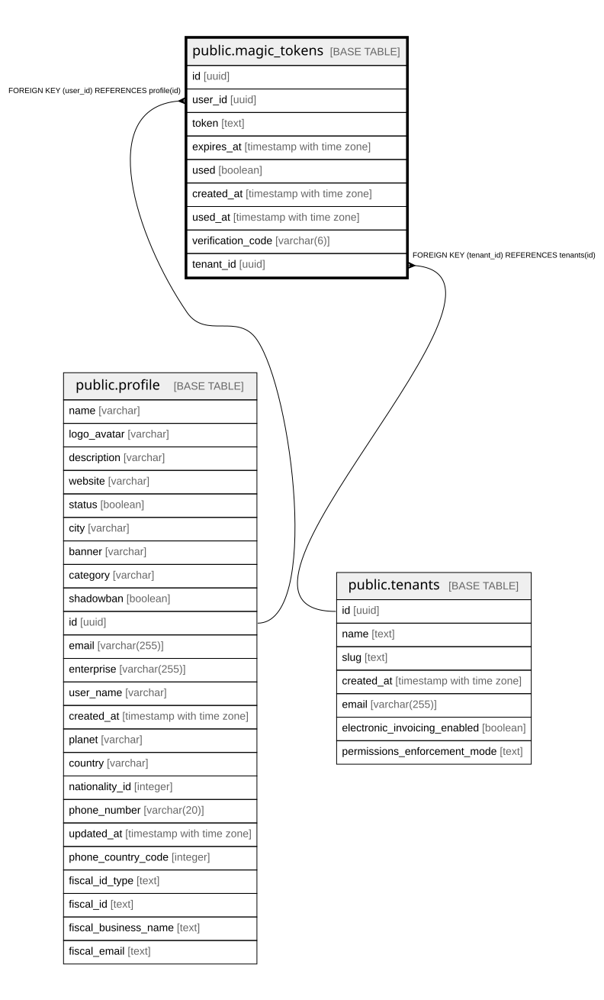

# public.magic_tokens

## Columns

| Name | Type | Default | Nullable | Children | Parents | Comment |
| ---- | ---- | ------- | -------- | -------- | ------- | ------- |
| id | uuid | gen_random_uuid() | false |  |  |  |
| user_id | uuid |  | false |  | [public.profile](public.profile.md) |  |
| token | text |  | false |  |  |  |
| expires_at | timestamp with time zone |  | false |  |  |  |
| used | boolean | false | true |  |  |  |
| created_at | timestamp with time zone | now() | true |  |  |  |
| used_at | timestamp with time zone |  | true |  |  |  |
| verification_code | varchar(6) |  | true |  |  |  |
| tenant_id | uuid |  | true |  | [public.tenants](public.tenants.md) |  |

## Constraints

| Name | Type | Definition |
| ---- | ---- | ---------- |
| magic_tokens_pkey | PRIMARY KEY | PRIMARY KEY (id) |
| magic_tokens_token_unique | UNIQUE | UNIQUE (token) |
| magic_tokens_user_id_profile_id_fk | FOREIGN KEY | FOREIGN KEY (user_id) REFERENCES profile(id) |
| magic_tokens_tenant_id_fkey | FOREIGN KEY | FOREIGN KEY (tenant_id) REFERENCES tenants(id) |

## Indexes

| Name | Definition |
| ---- | ---------- |
| magic_tokens_pkey | CREATE UNIQUE INDEX magic_tokens_pkey ON public.magic_tokens USING btree (id) |
| magic_tokens_token_unique | CREATE UNIQUE INDEX magic_tokens_token_unique ON public.magic_tokens USING btree (token) |
| idx_magic_tokens_created_at | CREATE INDEX idx_magic_tokens_created_at ON public.magic_tokens USING btree (created_at) |
| idx_magic_tokens_used | CREATE INDEX idx_magic_tokens_used ON public.magic_tokens USING btree (used) |
| idx_magic_tokens_user_id_created | CREATE INDEX idx_magic_tokens_user_id_created ON public.magic_tokens USING btree (user_id, created_at) |

## Relations

---

> Generated by [tbls](https://github.com/k1LoW/tbls)
