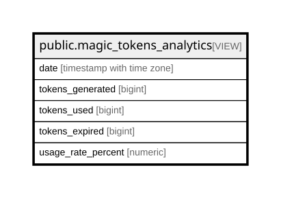

# public.magic_tokens_analytics

## Description

Daily analytics for magic token generation and usage

<details>
<summary><strong>Table Definition</strong></summary>

```sql
CREATE VIEW magic_tokens_analytics AS (
 SELECT date_trunc('day'::text, created_at) AS date,
    count(*) AS tokens_generated,
    count(
        CASE
            WHEN (used = true) THEN 1
            ELSE NULL::integer
        END) AS tokens_used,
    count(
        CASE
            WHEN ((used = false) AND (expires_at < now())) THEN 1
            ELSE NULL::integer
        END) AS tokens_expired,
    round((((count(
        CASE
            WHEN (used = true) THEN 1
            ELSE NULL::integer
        END))::numeric / (count(*))::numeric) * (100)::numeric), 2) AS usage_rate_percent
   FROM magic_tokens
  GROUP BY (date_trunc('day'::text, created_at))
  ORDER BY (date_trunc('day'::text, created_at)) DESC
)
```

</details>

## Columns

| Name | Type | Default | Nullable | Children | Parents | Comment |
| ---- | ---- | ------- | -------- | -------- | ------- | ------- |
| date | timestamp with time zone |  | true |  |  |  |
| tokens_generated | bigint |  | true |  |  |  |
| tokens_used | bigint |  | true |  |  |  |
| tokens_expired | bigint |  | true |  |  |  |
| usage_rate_percent | numeric |  | true |  |  |  |

## Referenced Tables

| Name | Columns | Comment | Type |
| ---- | ------- | ------- | ---- |
| [public.magic_tokens](public.magic_tokens.md) | 9 |  | BASE TABLE |

## Relations



---

> Generated by [tbls](https://github.com/k1LoW/tbls)
