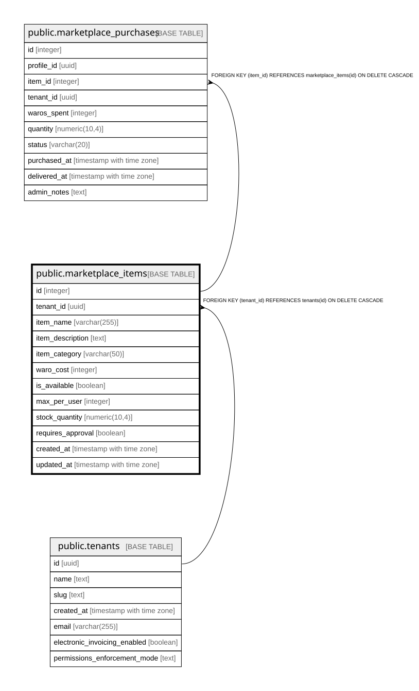

# public.marketplace_items

## Columns

| Name | Type | Default | Nullable | Children | Parents | Comment |
| ---- | ---- | ------- | -------- | -------- | ------- | ------- |
| id | integer | nextval('marketplace_items_id_seq'::regclass) | false | [public.marketplace_purchases](public.marketplace_purchases.md) |  |  |
| tenant_id | uuid |  | false |  | [public.tenants](public.tenants.md) |  |
| item_name | varchar(255) |  | false |  |  |  |
| item_description | text |  | true |  |  |  |
| item_category | varchar(50) |  | true |  |  |  |
| waro_cost | integer |  | false |  |  |  |
| is_available | boolean | true | true |  |  |  |
| max_per_user | integer | 1 | true |  |  |  |
| stock_quantity | numeric(10,4) |  | true |  |  | Current stock quantity available. NUMERIC(10,4) supports fractional stock levels. |
| requires_approval | boolean | false | true |  |  |  |
| created_at | timestamp with time zone | now() | true |  |  |  |
| updated_at | timestamp with time zone | now() | true |  |  |  |

## Constraints

| Name | Type | Definition |
| ---- | ---- | ---------- |
| marketplace_items_pkey | PRIMARY KEY | PRIMARY KEY (id) |
| marketplace_items_tenant_id_name_unique | UNIQUE | UNIQUE (tenant_id, item_name) |
| marketplace_items_tenant_id_fkey | FOREIGN KEY | FOREIGN KEY (tenant_id) REFERENCES tenants(id) ON DELETE CASCADE |

## Indexes

| Name | Definition |
| ---- | ---------- |
| marketplace_items_pkey | CREATE UNIQUE INDEX marketplace_items_pkey ON public.marketplace_items USING btree (id) |
| marketplace_items_tenant_id_name_unique | CREATE UNIQUE INDEX marketplace_items_tenant_id_name_unique ON public.marketplace_items USING btree (tenant_id, item_name) |

## Relations

---

> Generated by [tbls](https://github.com/k1LoW/tbls)
