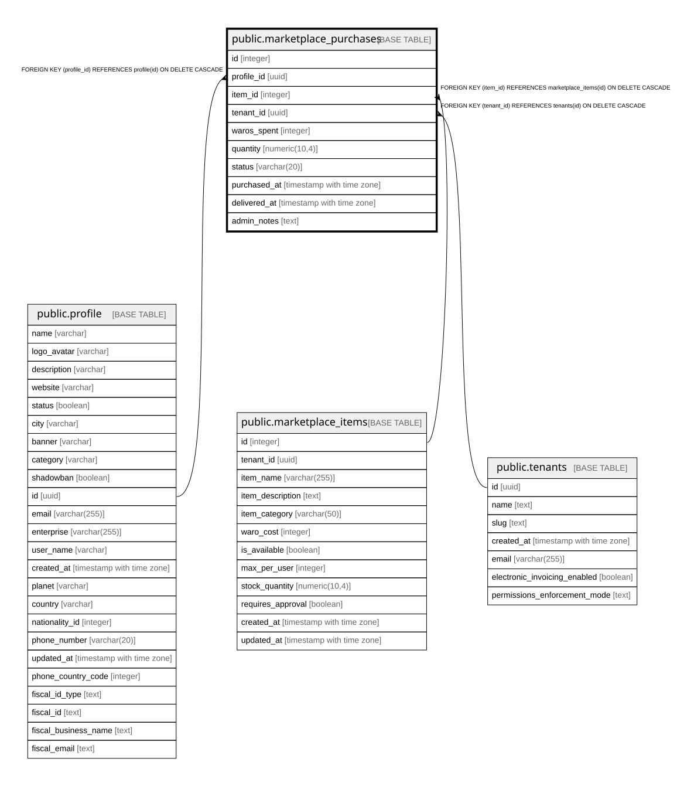

# public.marketplace_purchases

## Columns

| Name | Type | Default | Nullable | Children | Parents | Comment |
| ---- | ---- | ------- | -------- | -------- | ------- | ------- |
| id | integer | nextval('marketplace_purchases_id_seq'::regclass) | false |  |  |  |
| profile_id | uuid |  | false |  | [public.profile](public.profile.md) |  |
| item_id | integer |  | false |  | [public.marketplace_items](public.marketplace_items.md) |  |
| tenant_id | uuid |  | false |  | [public.tenants](public.tenants.md) |  |
| waros_spent | integer |  | false |  |  |  |
| quantity | numeric(10,4) | 1 | true |  |  | Quantity purchased from marketplace. NUMERIC(10,4) supports fractional quantities. |
| status | varchar(20) | 'pending'::character varying | true |  |  |  |
| purchased_at | timestamp with time zone | now() | true |  |  |  |
| delivered_at | timestamp with time zone |  | true |  |  |  |
| admin_notes | text |  | true |  |  |  |

## Constraints

| Name | Type | Definition |
| ---- | ---- | ---------- |
| marketplace_purchases_item_id_fkey | FOREIGN KEY | FOREIGN KEY (item_id) REFERENCES marketplace_items(id) ON DELETE CASCADE |
| marketplace_purchases_pkey | PRIMARY KEY | PRIMARY KEY (id) |
| marketplace_purchases_profile_id_fkey | FOREIGN KEY | FOREIGN KEY (profile_id) REFERENCES profile(id) ON DELETE CASCADE |
| marketplace_purchases_tenant_id_fkey | FOREIGN KEY | FOREIGN KEY (tenant_id) REFERENCES tenants(id) ON DELETE CASCADE |

## Indexes

| Name | Definition |
| ---- | ---------- |
| marketplace_purchases_pkey | CREATE UNIQUE INDEX marketplace_purchases_pkey ON public.marketplace_purchases USING btree (id) |
| idx_marketplace_purchases_profile | CREATE INDEX idx_marketplace_purchases_profile ON public.marketplace_purchases USING btree (profile_id, purchased_at DESC) |

## Relations

---

> Generated by [tbls](https://github.com/k1LoW/tbls)
