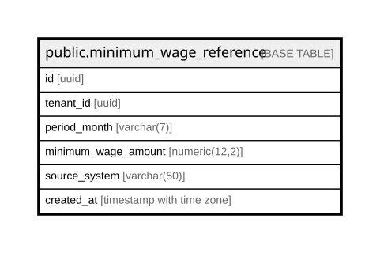

# public.minimum_wage_reference

## Columns

| Name | Type | Default | Nullable | Children | Parents | Comment |
| ---- | ---- | ------- | -------- | -------- | ------- | ------- |
| id | uuid | gen_random_uuid() | false |  |  |  |
| tenant_id | uuid |  | false |  |  |  |
| period_month | varchar(7) |  | false |  |  |  |
| minimum_wage_amount | numeric(12,2) |  | false |  |  |  |
| source_system | varchar(50) | 'manual'::character varying | true |  |  |  |
| created_at | timestamp with time zone | now() | true |  |  |  |

## Constraints

| Name | Type | Definition |
| ---- | ---- | ---------- |
| minimum_wage_reference_pkey | PRIMARY KEY | PRIMARY KEY (id) |

## Indexes

| Name | Definition |
| ---- | ---------- |
| minimum_wage_reference_pkey | CREATE UNIQUE INDEX minimum_wage_reference_pkey ON public.minimum_wage_reference USING btree (id) |

## Relations

---

> Generated by [tbls](https://github.com/k1LoW/tbls)
