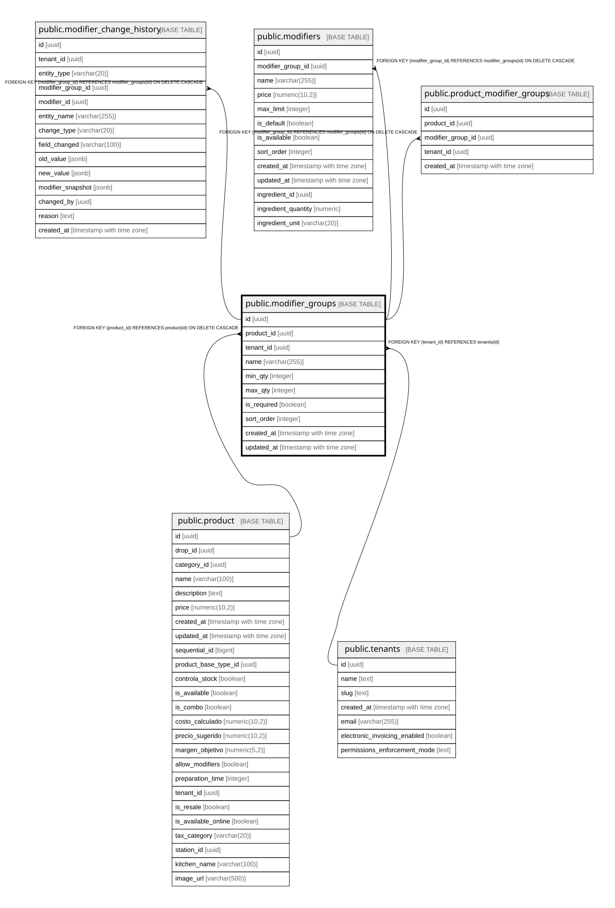

# public.modifier_groups

## Description

Grupos/categorías de modificadores (ej: "Tamaño", "Extras", "Tipo de carne")

## Columns

| Name | Type | Default | Nullable | Children | Parents | Comment |
| ---- | ---- | ------- | -------- | -------- | ------- | ------- |
| id | uuid | gen_random_uuid() | false | [public.modifier_change_history](public.modifier_change_history.md) [public.modifiers](public.modifiers.md) [public.product_modifier_groups](public.product_modifier_groups.md) |  |  |
| product_id | uuid |  | true |  | [public.product](public.product.md) |  |
| tenant_id | uuid |  | false |  | [public.tenants](public.tenants.md) |  |
| name | varchar(255) |  | false |  |  |  |
| min_qty | integer | 0 | false |  |  | Mínimo a seleccionar: 0 = opcional, \>=1 = obligatorio seleccionar al menos N |
| max_qty | integer | 1 | false |  |  | Máximo de opciones que se pueden seleccionar del grupo (1 = única opción) |
| is_required | boolean | false | false |  |  | true = cliente DEBE seleccionar del grupo, false = opcional |
| sort_order | integer | 0 | true |  |  |  |
| created_at | timestamp with time zone | now() | true |  |  |  |
| updated_at | timestamp with time zone | now() | true |  |  |  |

## Constraints

| Name | Type | Definition |
| ---- | ---- | ---------- |
| check_modifier_group_max_qty | CHECK | CHECK (((max_qty > 0) AND (max_qty <= 20))) |
| check_modifier_group_min_max | CHECK | CHECK (((min_qty >= 0) AND (min_qty <= max_qty))) |
| modifier_groups_pkey | PRIMARY KEY | PRIMARY KEY (id) |
| modifier_groups_product_id_fkey | FOREIGN KEY | FOREIGN KEY (product_id) REFERENCES product(id) ON DELETE CASCADE |
| modifier_groups_tenant_id_fkey | FOREIGN KEY | FOREIGN KEY (tenant_id) REFERENCES tenants(id) |
| modifier_groups_name_tenant_key | UNIQUE | UNIQUE (name, tenant_id) |

## Indexes

| Name | Definition |
| ---- | ---------- |
| modifier_groups_pkey | CREATE UNIQUE INDEX modifier_groups_pkey ON public.modifier_groups USING btree (id) |
| idx_modifier_groups_product | CREATE INDEX idx_modifier_groups_product ON public.modifier_groups USING btree (product_id) |
| idx_modifier_groups_sort | CREATE INDEX idx_modifier_groups_sort ON public.modifier_groups USING btree (product_id, sort_order) |
| idx_modifier_groups_tenant | CREATE INDEX idx_modifier_groups_tenant ON public.modifier_groups USING btree (tenant_id) |
| modifier_groups_name_tenant_key | CREATE UNIQUE INDEX modifier_groups_name_tenant_key ON public.modifier_groups USING btree (name, tenant_id) |

## Triggers

| Name | Definition |
| ---- | ---------- |
| trigger_update_modifier_groups_timestamp | CREATE TRIGGER trigger_update_modifier_groups_timestamp BEFORE UPDATE ON public.modifier_groups FOR EACH ROW EXECUTE FUNCTION update_updated_at_column() |

## Relations

---

> Generated by [tbls](https://github.com/k1LoW/tbls)
