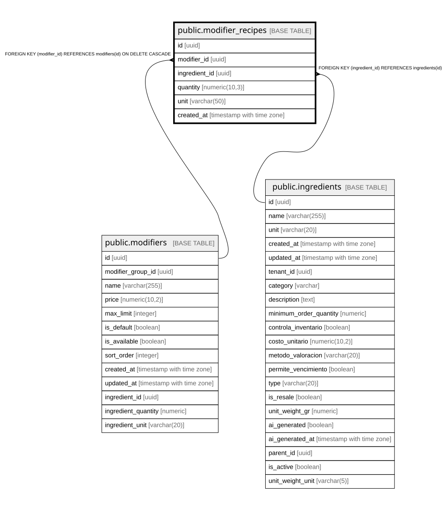

# public.modifier_recipes

## Description

Recetas de modificadores (qué ingredientes consume cada modificador). Solo si el modificador afecta inventario.

## Columns

| Name | Type | Default | Nullable | Children | Parents | Comment |
| ---- | ---- | ------- | -------- | -------- | ------- | ------- |
| id | uuid | gen_random_uuid() | false |  |  |  |
| modifier_id | uuid |  | false |  | [public.modifiers](public.modifiers.md) |  |
| ingredient_id | uuid |  | false |  | [public.ingredients](public.ingredients.md) |  |
| quantity | numeric(10,3) |  | false |  |  | Cantidad del ingrediente que consume este modificador al agregarse |
| unit | varchar(50) |  | false |  |  |  |
| created_at | timestamp with time zone | now() | true |  |  |  |

## Constraints

| Name | Type | Definition |
| ---- | ---- | ---------- |
| check_modifier_recipe_quantity_positive | CHECK | CHECK ((quantity > (0)::numeric)) |
| modifier_recipes_ingredient_id_fkey | FOREIGN KEY | FOREIGN KEY (ingredient_id) REFERENCES ingredients(id) |
| modifier_recipes_pkey | PRIMARY KEY | PRIMARY KEY (id) |
| modifier_recipes_modifier_id_fkey | FOREIGN KEY | FOREIGN KEY (modifier_id) REFERENCES modifiers(id) ON DELETE CASCADE |

## Indexes

| Name | Definition |
| ---- | ---------- |
| modifier_recipes_pkey | CREATE UNIQUE INDEX modifier_recipes_pkey ON public.modifier_recipes USING btree (id) |
| idx_modifier_recipes_ingredient | CREATE INDEX idx_modifier_recipes_ingredient ON public.modifier_recipes USING btree (ingredient_id) |
| idx_modifier_recipes_modifier | CREATE INDEX idx_modifier_recipes_modifier ON public.modifier_recipes USING btree (modifier_id) |

## Relations

---

> Generated by [tbls](https://github.com/k1LoW/tbls)
