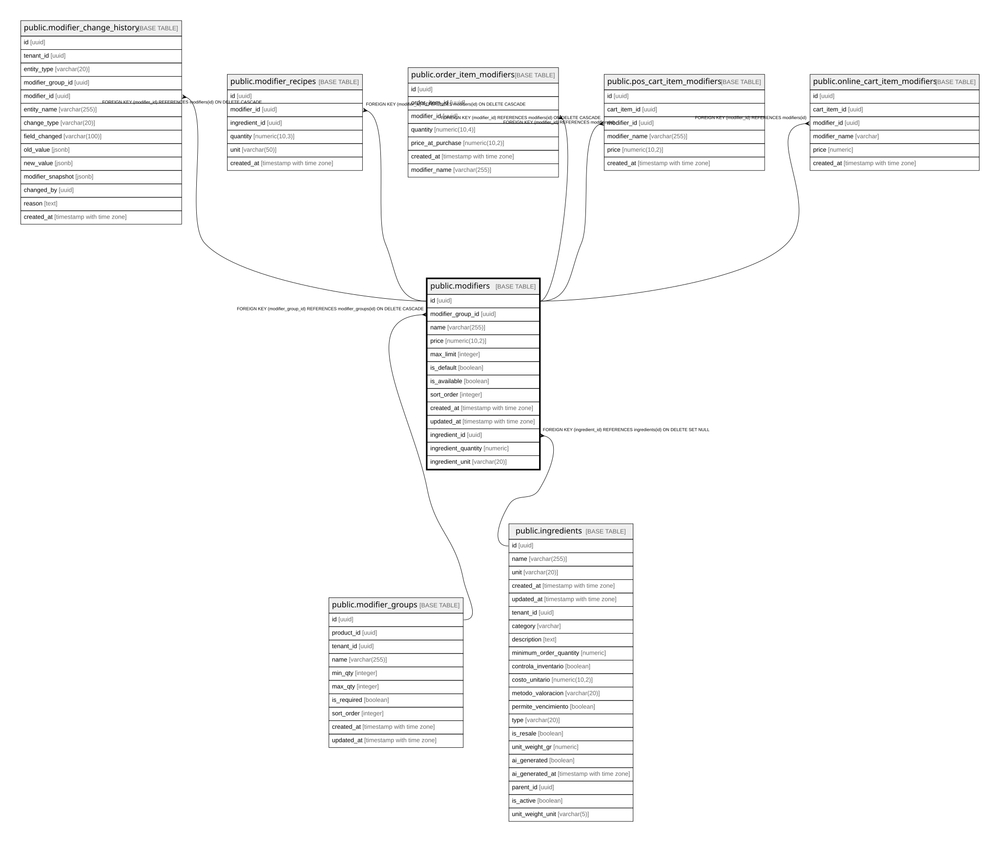

# public.modifiers

## Description

Opciones específicas dentro de grupos (ej: "Queso extra", "Sin cebolla", "Término medio")

## Columns

| Name | Type | Default | Nullable | Children | Parents | Comment |
| ---- | ---- | ------- | -------- | -------- | ------- | ------- |
| id | uuid | gen_random_uuid() | false | [public.modifier_change_history](public.modifier_change_history.md) [public.modifier_recipes](public.modifier_recipes.md) [public.order_item_modifiers](public.order_item_modifiers.md) [public.pos_cart_item_modifiers](public.pos_cart_item_modifiers.md) [public.online_cart_item_modifiers](public.online_cart_item_modifiers.md) |  |  |
| modifier_group_id | uuid |  | false |  | [public.modifier_groups](public.modifier_groups.md) |  |
| name | varchar(255) |  | false |  |  |  |
| price | numeric(10,2) | 0 | false |  |  | Precio adicional al producto base (puede ser 0 si no tiene costo extra) |
| max_limit | integer | 1 | true |  |  | Cuántas veces se puede agregar este modificador (ej: 2 = puede pedir doble queso) |
| is_default | boolean | false | true |  |  | true = viene seleccionado por defecto al agregar el producto |
| is_available | boolean | true | true |  |  |  |
| sort_order | integer | 0 | true |  |  |  |
| created_at | timestamp with time zone | now() | true |  |  |  |
| updated_at | timestamp with time zone | now() | true |  |  |  |
| ingredient_id | uuid |  | true |  | [public.ingredients](public.ingredients.md) |  |
| ingredient_quantity | numeric |  | true |  |  |  |
| ingredient_unit | varchar(20) | NULL::character varying | true |  |  |  |

## Constraints

| Name | Type | Definition |
| ---- | ---- | ---------- |
| check_modifier_max_limit | CHECK | CHECK ((max_limit > 0)) |
| check_modifier_price_positive | CHECK | CHECK ((price >= (0)::numeric)) |
| modifiers_ingredient_id_fkey | FOREIGN KEY | FOREIGN KEY (ingredient_id) REFERENCES ingredients(id) ON DELETE SET NULL |
| modifiers_modifier_group_id_fkey | FOREIGN KEY | FOREIGN KEY (modifier_group_id) REFERENCES modifier_groups(id) ON DELETE CASCADE |
| modifiers_pkey | PRIMARY KEY | PRIMARY KEY (id) |

## Indexes

| Name | Definition |
| ---- | ---------- |
| modifiers_pkey | CREATE UNIQUE INDEX modifiers_pkey ON public.modifiers USING btree (id) |
| idx_modifiers_available | CREATE INDEX idx_modifiers_available ON public.modifiers USING btree (is_available) WHERE (is_available = true) |
| idx_modifiers_group | CREATE INDEX idx_modifiers_group ON public.modifiers USING btree (modifier_group_id) |
| idx_modifiers_sort | CREATE INDEX idx_modifiers_sort ON public.modifiers USING btree (modifier_group_id, sort_order) |

## Triggers

| Name | Definition |
| ---- | ---------- |
| trigger_update_modifiers_timestamp | CREATE TRIGGER trigger_update_modifiers_timestamp BEFORE UPDATE ON public.modifiers FOR EACH ROW EXECUTE FUNCTION update_updated_at_column() |

## Relations

---

> Generated by [tbls](https://github.com/k1LoW/tbls)
