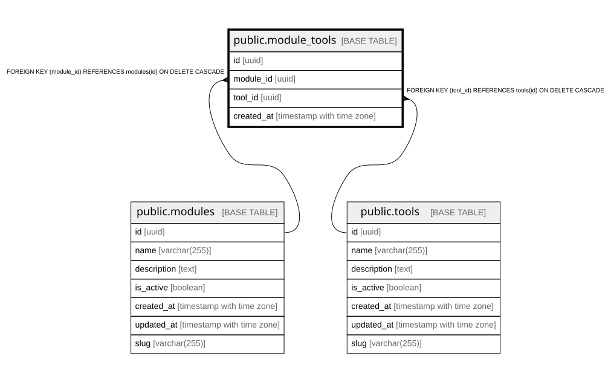

# public.module_tools

## Columns

| Name | Type | Default | Nullable | Children | Parents | Comment |
| ---- | ---- | ------- | -------- | -------- | ------- | ------- |
| id | uuid | gen_random_uuid() | false |  |  |  |
| module_id | uuid |  | false |  | [public.modules](public.modules.md) |  |
| tool_id | uuid |  | false |  | [public.tools](public.tools.md) |  |
| created_at | timestamp with time zone | now() | true |  |  |  |

## Constraints

| Name | Type | Definition |
| ---- | ---- | ---------- |
| module_tools_module_id_tool_id_key | UNIQUE | UNIQUE (module_id, tool_id) |
| module_tools_pkey | PRIMARY KEY | PRIMARY KEY (id) |
| module_tools_module_id_fkey | FOREIGN KEY | FOREIGN KEY (module_id) REFERENCES modules(id) ON DELETE CASCADE |
| module_tools_tool_id_fkey | FOREIGN KEY | FOREIGN KEY (tool_id) REFERENCES tools(id) ON DELETE CASCADE |

## Indexes

| Name | Definition |
| ---- | ---------- |
| module_tools_module_id_tool_id_key | CREATE UNIQUE INDEX module_tools_module_id_tool_id_key ON public.module_tools USING btree (module_id, tool_id) |
| module_tools_pkey | CREATE UNIQUE INDEX module_tools_pkey ON public.module_tools USING btree (id) |
| idx_module_tools_module | CREATE INDEX idx_module_tools_module ON public.module_tools USING btree (module_id) |
| idx_module_tools_tool | CREATE INDEX idx_module_tools_tool ON public.module_tools USING btree (tool_id) |

## Relations

---

> Generated by [tbls](https://github.com/k1LoW/tbls)
