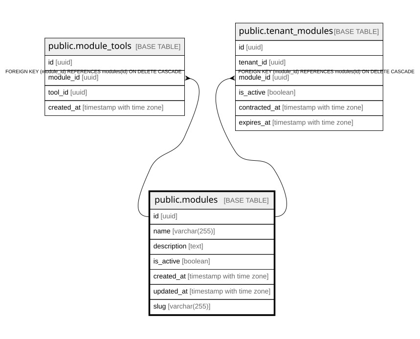

# public.modules

## Columns

| Name | Type | Default | Nullable | Children | Parents | Comment |
| ---- | ---- | ------- | -------- | -------- | ------- | ------- |
| id | uuid | gen_random_uuid() | false | [public.module_tools](public.module_tools.md) [public.tenant_modules](public.tenant_modules.md) |  |  |
| name | varchar(255) |  | false |  |  |  |
| description | text |  | true |  |  |  |
| is_active | boolean | true | true |  |  |  |
| created_at | timestamp with time zone | now() | true |  |  |  |
| updated_at | timestamp with time zone | now() | true |  |  |  |
| slug | varchar(255) |  | true |  |  |  |

## Constraints

| Name | Type | Definition |
| ---- | ---- | ---------- |
| modules_name_key | UNIQUE | UNIQUE (name) |
| modules_pkey | PRIMARY KEY | PRIMARY KEY (id) |
| modules_slug_key | UNIQUE | UNIQUE (slug) |

## Indexes

| Name | Definition |
| ---- | ---------- |
| modules_name_key | CREATE UNIQUE INDEX modules_name_key ON public.modules USING btree (name) |
| modules_pkey | CREATE UNIQUE INDEX modules_pkey ON public.modules USING btree (id) |
| modules_slug_key | CREATE UNIQUE INDEX modules_slug_key ON public.modules USING btree (slug) |
| idx_modules_active | CREATE INDEX idx_modules_active ON public.modules USING btree (is_active) |
| idx_modules_name | CREATE INDEX idx_modules_name ON public.modules USING btree (name) |

## Relations

---

> Generated by [tbls](https://github.com/k1LoW/tbls)
