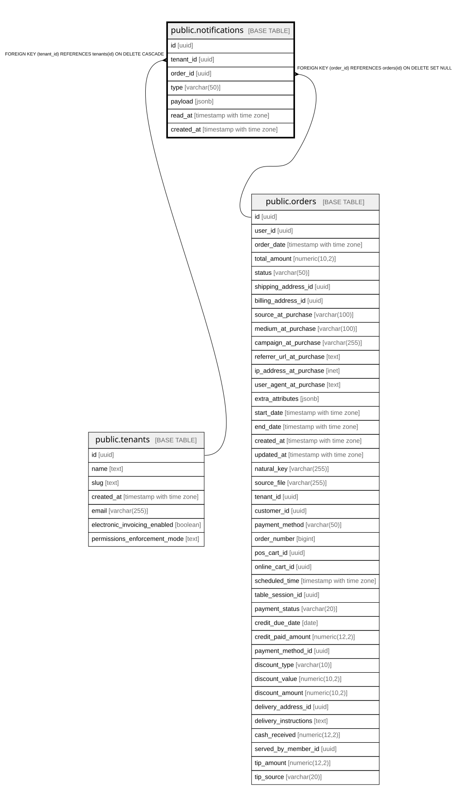

# public.notifications

## Columns

| Name | Type | Default | Nullable | Children | Parents | Comment |
| ---- | ---- | ------- | -------- | -------- | ------- | ------- |
| id | uuid | gen_random_uuid() | false |  |  |  |
| tenant_id | uuid |  | false |  | [public.tenants](public.tenants.md) |  |
| order_id | uuid |  | true |  | [public.orders](public.orders.md) |  |
| type | varchar(50) | 'new_order'::character varying | false |  |  |  |
| payload | jsonb | '{}'::jsonb | false |  |  |  |
| read_at | timestamp with time zone |  | true |  |  |  |
| created_at | timestamp with time zone | now() | false |  |  |  |

## Constraints

| Name | Type | Definition |
| ---- | ---- | ---------- |
| notifications_order_id_fkey | FOREIGN KEY | FOREIGN KEY (order_id) REFERENCES orders(id) ON DELETE SET NULL |
| notifications_tenant_id_fkey | FOREIGN KEY | FOREIGN KEY (tenant_id) REFERENCES tenants(id) ON DELETE CASCADE |
| notifications_pkey | PRIMARY KEY | PRIMARY KEY (id) |

## Indexes

| Name | Definition |
| ---- | ---------- |
| notifications_pkey | CREATE UNIQUE INDEX notifications_pkey ON public.notifications USING btree (id) |
| idx_notifications_tenant_unread | CREATE INDEX idx_notifications_tenant_unread ON public.notifications USING btree (tenant_id, created_at DESC) WHERE (read_at IS NULL) |
| idx_notifications_order_id | CREATE INDEX idx_notifications_order_id ON public.notifications USING btree (order_id) |

## Relations

---

> Generated by [tbls](https://github.com/k1LoW/tbls)
