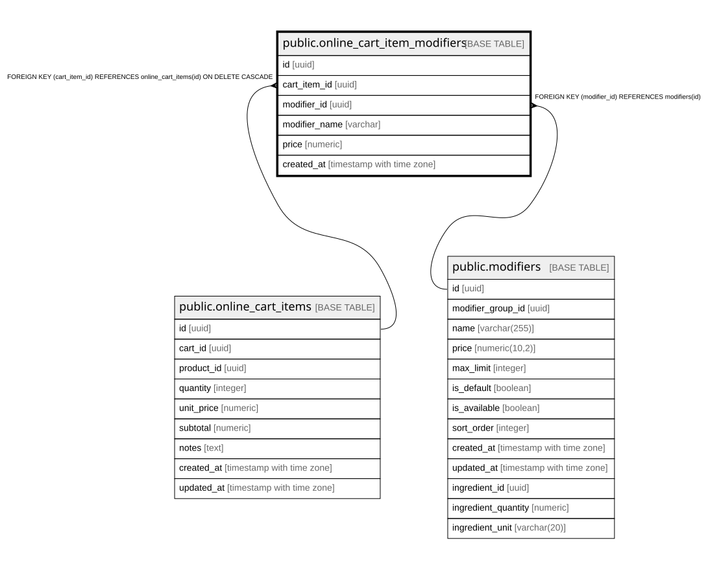

# public.online_cart_item_modifiers

## Columns

| Name | Type | Default | Nullable | Children | Parents | Comment |
| ---- | ---- | ------- | -------- | -------- | ------- | ------- |
| id | uuid | gen_random_uuid() | false |  |  |  |
| cart_item_id | uuid |  | false |  | [public.online_cart_items](public.online_cart_items.md) |  |
| modifier_id | uuid |  | false |  | [public.modifiers](public.modifiers.md) |  |
| modifier_name | varchar |  | false |  |  |  |
| price | numeric |  | false |  |  |  |
| created_at | timestamp with time zone | now() | true |  |  |  |

## Constraints

| Name | Type | Definition |
| ---- | ---- | ---------- |
| online_cart_item_modifiers_modifier_id_fkey | FOREIGN KEY | FOREIGN KEY (modifier_id) REFERENCES modifiers(id) |
| online_cart_item_modifiers_cart_item_id_fkey | FOREIGN KEY | FOREIGN KEY (cart_item_id) REFERENCES online_cart_items(id) ON DELETE CASCADE |
| online_cart_item_modifiers_pkey | PRIMARY KEY | PRIMARY KEY (id) |

## Indexes

| Name | Definition |
| ---- | ---------- |
| online_cart_item_modifiers_pkey | CREATE UNIQUE INDEX online_cart_item_modifiers_pkey ON public.online_cart_item_modifiers USING btree (id) |
| idx_online_cart_item_modifiers_item | CREATE INDEX idx_online_cart_item_modifiers_item ON public.online_cart_item_modifiers USING btree (cart_item_id) |

## Relations

---

> Generated by [tbls](https://github.com/k1LoW/tbls)
