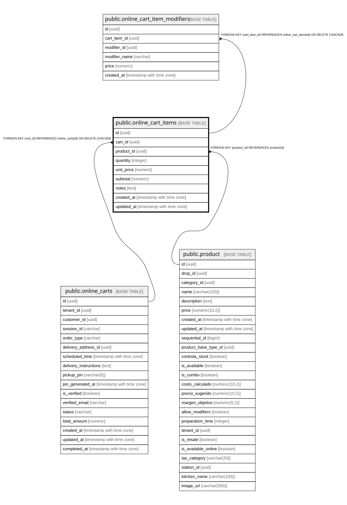

# public.online_cart_items

## Columns

| Name | Type | Default | Nullable | Children | Parents | Comment |
| ---- | ---- | ------- | -------- | -------- | ------- | ------- |
| id | uuid | gen_random_uuid() | false | [public.online_cart_item_modifiers](public.online_cart_item_modifiers.md) |  |  |
| cart_id | uuid |  | false |  | [public.online_carts](public.online_carts.md) |  |
| product_id | uuid |  | false |  | [public.product](public.product.md) |  |
| quantity | integer | 1 | false |  |  |  |
| unit_price | numeric |  | false |  |  |  |
| subtotal | numeric |  | false |  |  |  |
| notes | text |  | true |  |  |  |
| created_at | timestamp with time zone | now() | true |  |  |  |
| updated_at | timestamp with time zone | now() | true |  |  |  |

## Constraints

| Name | Type | Definition |
| ---- | ---- | ---------- |
| online_cart_items_product_id_fkey | FOREIGN KEY | FOREIGN KEY (product_id) REFERENCES product(id) |
| online_cart_items_cart_id_fkey | FOREIGN KEY | FOREIGN KEY (cart_id) REFERENCES online_carts(id) ON DELETE CASCADE |
| online_cart_items_pkey | PRIMARY KEY | PRIMARY KEY (id) |

## Indexes

| Name | Definition |
| ---- | ---------- |
| online_cart_items_pkey | CREATE UNIQUE INDEX online_cart_items_pkey ON public.online_cart_items USING btree (id) |
| idx_online_cart_items_cart | CREATE INDEX idx_online_cart_items_cart ON public.online_cart_items USING btree (cart_id) |
| idx_online_cart_items_product | CREATE INDEX idx_online_cart_items_product ON public.online_cart_items USING btree (product_id) |

## Relations

---

> Generated by [tbls](https://github.com/k1LoW/tbls)
