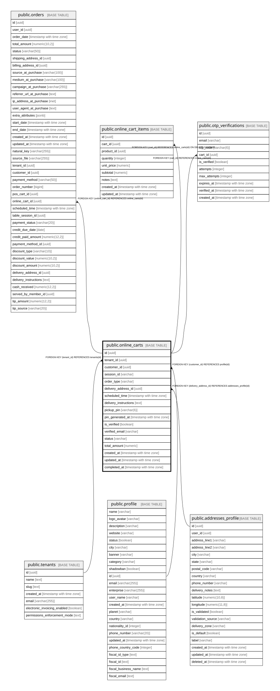

# public.online_carts

## Columns

| Name | Type | Default | Nullable | Children | Parents | Comment |
| ---- | ---- | ------- | -------- | -------- | ------- | ------- |
| id | uuid | gen_random_uuid() | false | [public.orders](public.orders.md) [public.online_cart_items](public.online_cart_items.md) [public.otp_verifications](public.otp_verifications.md) |  |  |
| tenant_id | uuid |  | false |  | [public.tenants](public.tenants.md) |  |
| customer_id | uuid |  | true |  | [public.profile](public.profile.md) |  |
| session_id | varchar |  | true |  |  |  |
| order_type | varchar | 'delivery'::character varying | false |  |  |  |
| delivery_address_id | uuid |  | true |  | [public.addresses_profile](public.addresses_profile.md) |  |
| scheduled_time | timestamp with time zone |  | true |  |  |  |
| delivery_instructions | text |  | true |  |  |  |
| pickup_pin | varchar(6) |  | true |  |  |  |
| pin_generated_at | timestamp with time zone |  | true |  |  |  |
| is_verified | boolean | false | true |  |  |  |
| verified_email | varchar |  | true |  |  |  |
| status | varchar | 'active'::character varying | false |  |  |  |
| total_amount | numeric | 0 | true |  |  |  |
| created_at | timestamp with time zone | now() | true |  |  |  |
| updated_at | timestamp with time zone | now() | true |  |  |  |
| completed_at | timestamp with time zone |  | true |  |  |  |

## Constraints

| Name | Type | Definition |
| ---- | ---- | ---------- |
| online_carts_customer_id_fkey | FOREIGN KEY | FOREIGN KEY (customer_id) REFERENCES profile(id) |
| online_carts_tenant_id_fkey | FOREIGN KEY | FOREIGN KEY (tenant_id) REFERENCES tenants(id) |
| online_carts_delivery_address_id_fkey | FOREIGN KEY | FOREIGN KEY (delivery_address_id) REFERENCES addresses_profile(id) |
| online_carts_pkey | PRIMARY KEY | PRIMARY KEY (id) |

## Indexes

| Name | Definition |
| ---- | ---------- |
| online_carts_pkey | CREATE UNIQUE INDEX online_carts_pkey ON public.online_carts USING btree (id) |
| idx_online_carts_tenant | CREATE INDEX idx_online_carts_tenant ON public.online_carts USING btree (tenant_id) |
| idx_online_carts_customer | CREATE INDEX idx_online_carts_customer ON public.online_carts USING btree (customer_id) |
| idx_online_carts_session | CREATE INDEX idx_online_carts_session ON public.online_carts USING btree (session_id) |
| idx_online_carts_status | CREATE INDEX idx_online_carts_status ON public.online_carts USING btree (status) |
| idx_online_carts_email | CREATE INDEX idx_online_carts_email ON public.online_carts USING btree (verified_email) |

## Relations

---

> Generated by [tbls](https://github.com/k1LoW/tbls)
