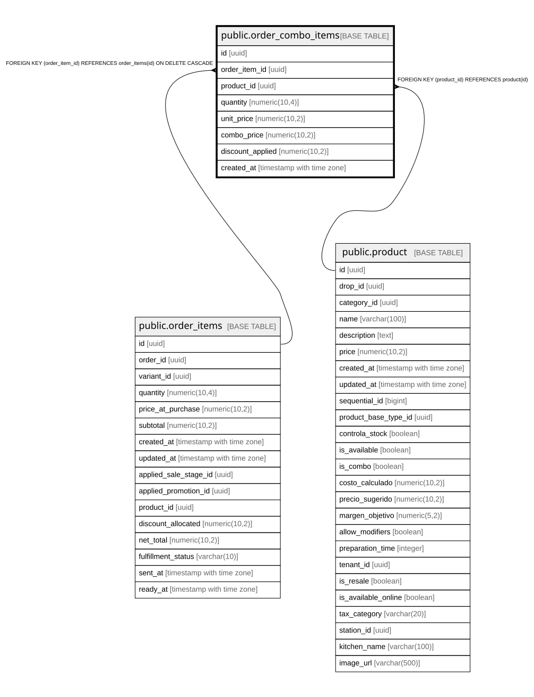

# public.order_combo_items

## Description

Detalle de productos incluidos en combos vendidos (histórico inmutable). Permite saber exactamente qué incluía cada combo vendido.

## Columns

| Name | Type | Default | Nullable | Children | Parents | Comment |
| ---- | ---- | ------- | -------- | -------- | ------- | ------- |
| id | uuid | gen_random_uuid() | false |  |  |  |
| order_item_id | uuid |  | false |  | [public.order_items](public.order_items.md) |  |
| product_id | uuid |  | false |  | [public.product](public.product.md) |  |
| quantity | numeric(10,4) |  | false |  |  | Quantity of this item in the ordered combo. NUMERIC(10,4) supports fractional quantities. |
| unit_price | numeric(10,2) |  | false |  |  | Precio individual del producto (sin descuento de combo) |
| combo_price | numeric(10,2) |  | false |  |  | Precio del producto dentro del combo (con descuento aplicado) |
| discount_applied | numeric(10,2) |  | true |  |  | Ahorro del cliente: unit_price - combo_price |
| created_at | timestamp with time zone | now() | true |  |  |  |

## Constraints

| Name | Type | Definition |
| ---- | ---- | ---------- |
| check_order_combo_prices_positive | CHECK | CHECK (((unit_price >= (0)::numeric) AND (combo_price >= (0)::numeric))) |
| check_order_combo_quantity_positive | CHECK | CHECK ((quantity > (0)::numeric)) |
| order_combo_items_pkey | PRIMARY KEY | PRIMARY KEY (id) |
| order_combo_items_order_item_id_fkey | FOREIGN KEY | FOREIGN KEY (order_item_id) REFERENCES order_items(id) ON DELETE CASCADE |
| order_combo_items_product_id_fkey | FOREIGN KEY | FOREIGN KEY (product_id) REFERENCES product(id) |

## Indexes

| Name | Definition |
| ---- | ---------- |
| order_combo_items_pkey | CREATE UNIQUE INDEX order_combo_items_pkey ON public.order_combo_items USING btree (id) |
| idx_order_combo_items_created | CREATE INDEX idx_order_combo_items_created ON public.order_combo_items USING btree (created_at DESC) |
| idx_order_combo_items_order_item | CREATE INDEX idx_order_combo_items_order_item ON public.order_combo_items USING btree (order_item_id) |
| idx_order_combo_items_product | CREATE INDEX idx_order_combo_items_product ON public.order_combo_items USING btree (product_id) |

## Relations

---

> Generated by [tbls](https://github.com/k1LoW/tbls)
