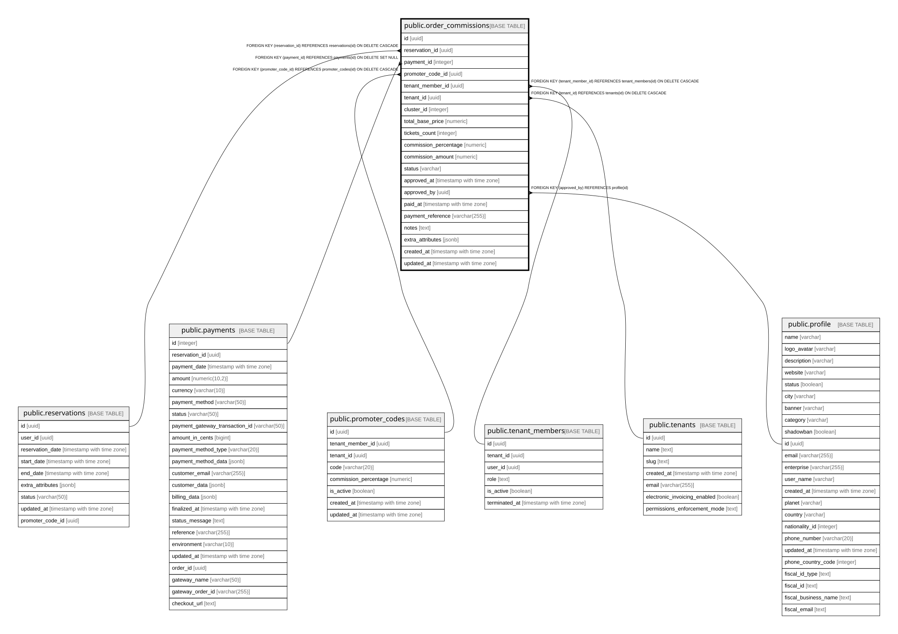

# public.order_commissions

## Columns

| Name | Type | Default | Nullable | Children | Parents | Comment |
| ---- | ---- | ------- | -------- | -------- | ------- | ------- |
| id | uuid | gen_random_uuid() | false |  |  |  |
| reservation_id | uuid |  | false |  | [public.reservations](public.reservations.md) |  |
| payment_id | integer |  | true |  | [public.payments](public.payments.md) |  |
| promoter_code_id | uuid |  | false |  | [public.promoter_codes](public.promoter_codes.md) |  |
| tenant_member_id | uuid |  | false |  | [public.tenant_members](public.tenant_members.md) |  |
| tenant_id | uuid |  | false |  | [public.tenants](public.tenants.md) |  |
| cluster_id | integer |  | true |  |  |  |
| total_base_price | numeric |  | false |  |  |  |
| tickets_count | integer |  | false |  |  |  |
| commission_percentage | numeric |  | false |  |  |  |
| commission_amount | numeric |  | false |  |  |  |
| status | varchar | 'pending'::character varying | true |  |  |  |
| approved_at | timestamp with time zone |  | true |  |  |  |
| approved_by | uuid |  | true |  | [public.profile](public.profile.md) |  |
| paid_at | timestamp with time zone |  | true |  |  |  |
| payment_reference | varchar(255) |  | true |  |  |  |
| notes | text |  | true |  |  |  |
| extra_attributes | jsonb |  | true |  |  |  |
| created_at | timestamp with time zone | now() | true |  |  |  |
| updated_at | timestamp with time zone | now() | true |  |  |  |

## Constraints

| Name | Type | Definition |
| ---- | ---- | ---------- |
| order_commissions_payment_fkey | FOREIGN KEY | FOREIGN KEY (payment_id) REFERENCES payments(id) ON DELETE SET NULL |
| order_commissions_approved_by_fkey | FOREIGN KEY | FOREIGN KEY (approved_by) REFERENCES profile(id) |
| order_commissions_reservation_fkey | FOREIGN KEY | FOREIGN KEY (reservation_id) REFERENCES reservations(id) ON DELETE CASCADE |
| order_commissions_tenant_member_fkey | FOREIGN KEY | FOREIGN KEY (tenant_member_id) REFERENCES tenant_members(id) ON DELETE CASCADE |
| order_commissions_tenant_fkey | FOREIGN KEY | FOREIGN KEY (tenant_id) REFERENCES tenants(id) ON DELETE CASCADE |
| order_commissions_promoter_code_fkey | FOREIGN KEY | FOREIGN KEY (promoter_code_id) REFERENCES promoter_codes(id) ON DELETE CASCADE |
| order_commissions_pkey | PRIMARY KEY | PRIMARY KEY (id) |

## Indexes

| Name | Definition |
| ---- | ---------- |
| order_commissions_pkey | CREATE UNIQUE INDEX order_commissions_pkey ON public.order_commissions USING btree (id) |
| idx_order_commissions_reservation | CREATE INDEX idx_order_commissions_reservation ON public.order_commissions USING btree (reservation_id) |
| idx_order_commissions_payment | CREATE INDEX idx_order_commissions_payment ON public.order_commissions USING btree (payment_id) |
| idx_order_commissions_promoter_code | CREATE INDEX idx_order_commissions_promoter_code ON public.order_commissions USING btree (promoter_code_id) |
| idx_order_commissions_status | CREATE INDEX idx_order_commissions_status ON public.order_commissions USING btree (status) |

## Relations

---

> Generated by [tbls](https://github.com/k1LoW/tbls)
