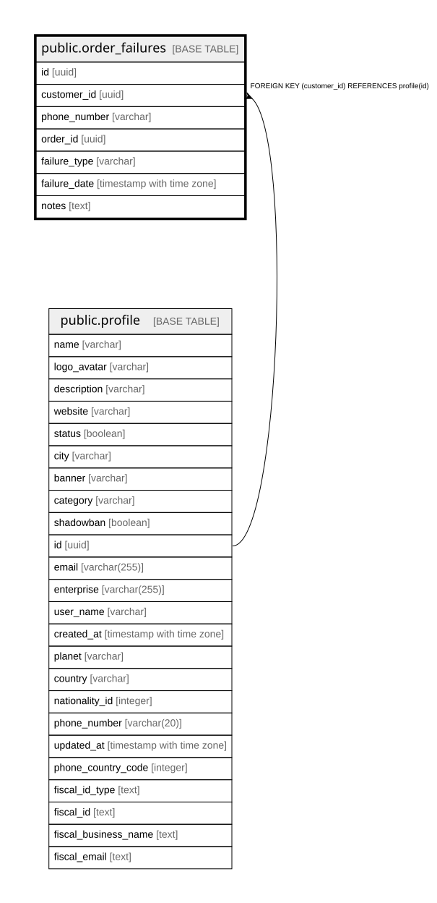

# public.order_failures

## Columns

| Name | Type | Default | Nullable | Children | Parents | Comment |
| ---- | ---- | ------- | -------- | -------- | ------- | ------- |
| id | uuid | gen_random_uuid() | false |  |  |  |
| customer_id | uuid |  | true |  | [public.profile](public.profile.md) |  |
| phone_number | varchar |  | false |  |  |  |
| order_id | uuid |  | true |  |  |  |
| failure_type | varchar |  | false |  |  |  |
| failure_date | timestamp with time zone | now() | true |  |  |  |
| notes | text |  | true |  |  |  |

## Constraints

| Name | Type | Definition |
| ---- | ---- | ---------- |
| order_failures_customer_id_fkey | FOREIGN KEY | FOREIGN KEY (customer_id) REFERENCES profile(id) |
| order_failures_pkey | PRIMARY KEY | PRIMARY KEY (id) |

## Indexes

| Name | Definition |
| ---- | ---------- |
| order_failures_pkey | CREATE UNIQUE INDEX order_failures_pkey ON public.order_failures USING btree (id) |
| idx_order_failures_customer | CREATE INDEX idx_order_failures_customer ON public.order_failures USING btree (customer_id) |
| idx_order_failures_phone | CREATE INDEX idx_order_failures_phone ON public.order_failures USING btree (phone_number) |
| idx_order_failures_date | CREATE INDEX idx_order_failures_date ON public.order_failures USING btree (failure_date) |

## Relations

---

> Generated by [tbls](https://github.com/k1LoW/tbls)
