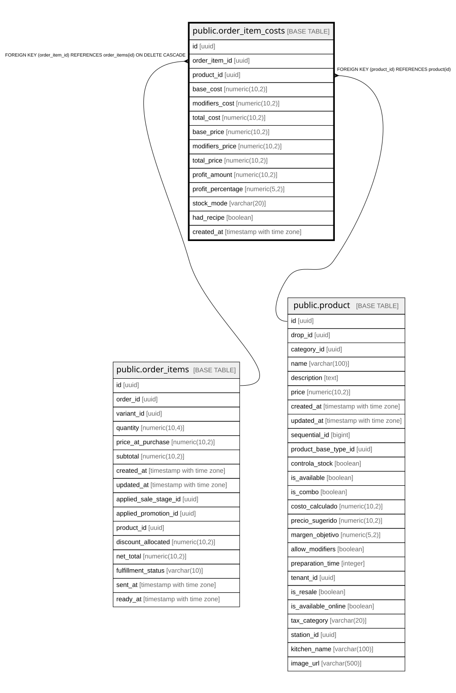

# public.order_item_costs

## Description

Snapshot inmutable de costos y rentabilidad al momento de cada venta. Los costos NO cambian aunque suban precios de ingredientes después.

## Columns

| Name | Type | Default | Nullable | Children | Parents | Comment |
| ---- | ---- | ------- | -------- | -------- | ------- | ------- |
| id | uuid | gen_random_uuid() | false |  |  |  |
| order_item_id | uuid |  | false |  | [public.order_items](public.order_items.md) |  |
| product_id | uuid |  | false |  | [public.product](public.product.md) |  |
| base_cost | numeric(10,2) | 0 | false |  |  |  |
| modifiers_cost | numeric(10,2) | 0 | false |  |  |  |
| total_cost | numeric(10,2) |  | false |  |  | Costo total congelado al momento de venta (incluye producto + modificadores) |
| base_price | numeric(10,2) |  | false |  |  |  |
| modifiers_price | numeric(10,2) | 0 | false |  |  |  |
| total_price | numeric(10,2) |  | false |  |  |  |
| profit_amount | numeric(10,2) |  | false |  |  |  |
| profit_percentage | numeric(5,2) |  | true |  |  | Margen porcentual: ((precio - costo) / costo) * 100 |
| stock_mode | varchar(20) |  | true |  |  | Modo de stock del producto al momento de venta (para análisis histórico) |
| had_recipe | boolean | false | true |  |  |  |
| created_at | timestamp with time zone | now() | true |  |  |  |

## Constraints

| Name | Type | Definition |
| ---- | ---- | ---------- |
| check_order_costs_total_cost | CHECK | CHECK ((total_cost >= (0)::numeric)) |
| check_order_costs_total_price | CHECK | CHECK ((total_price >= (0)::numeric)) |
| order_item_costs_order_item_id_key | UNIQUE | UNIQUE (order_item_id) |
| order_item_costs_pkey | PRIMARY KEY | PRIMARY KEY (id) |
| order_item_costs_order_item_id_fkey | FOREIGN KEY | FOREIGN KEY (order_item_id) REFERENCES order_items(id) ON DELETE CASCADE |
| order_item_costs_product_id_fkey | FOREIGN KEY | FOREIGN KEY (product_id) REFERENCES product(id) |

## Indexes

| Name | Definition |
| ---- | ---------- |
| order_item_costs_order_item_id_key | CREATE UNIQUE INDEX order_item_costs_order_item_id_key ON public.order_item_costs USING btree (order_item_id) |
| order_item_costs_pkey | CREATE UNIQUE INDEX order_item_costs_pkey ON public.order_item_costs USING btree (id) |
| idx_order_item_costs_created | CREATE INDEX idx_order_item_costs_created ON public.order_item_costs USING btree (created_at DESC) |
| idx_order_item_costs_order_item | CREATE INDEX idx_order_item_costs_order_item ON public.order_item_costs USING btree (order_item_id) |
| idx_order_item_costs_product | CREATE INDEX idx_order_item_costs_product ON public.order_item_costs USING btree (product_id) |
| idx_order_item_costs_profit | CREATE INDEX idx_order_item_costs_profit ON public.order_item_costs USING btree (profit_percentage) |

## Relations

---

> Generated by [tbls](https://github.com/k1LoW/tbls)
