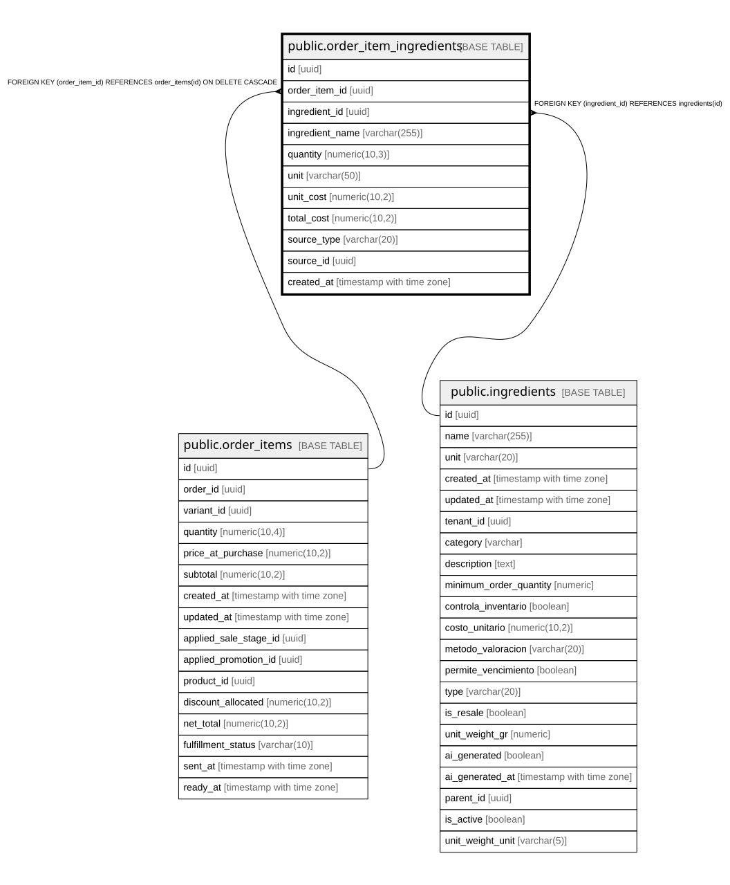

# public.order_item_ingredients

## Description

Detalle inmutable de ingredientes consumidos en cada venta. Permite trazabilidad completa y análisis de consumo.

## Columns

| Name | Type | Default | Nullable | Children | Parents | Comment |
| ---- | ---- | ------- | -------- | -------- | ------- | ------- |
| id | uuid | gen_random_uuid() | false |  |  |  |
| order_item_id | uuid |  | false |  | [public.order_items](public.order_items.md) |  |
| ingredient_id | uuid |  | false |  | [public.ingredients](public.ingredients.md) |  |
| ingredient_name | varchar(255) |  | false |  |  | Nombre histórico del ingrediente (por si cambia el nombre después) |
| quantity | numeric(10,3) |  | false |  |  |  |
| unit | varchar(50) |  | false |  |  |  |
| unit_cost | numeric(10,2) |  | true |  |  | Costo unitario del ingrediente al momento exacto de la venta |
| total_cost | numeric(10,2) |  | true |  |  |  |
| source_type | varchar(20) |  | false |  |  | PRODUCT_RECIPE si vino del producto base, MODIFIER_RECIPE si de un modificador |
| source_id | uuid |  | false |  |  |  |
| created_at | timestamp with time zone | now() | true |  |  |  |

## Constraints

| Name | Type | Definition |
| ---- | ---- | ---------- |
| check_order_ingredient_quantity_positive | CHECK | CHECK ((quantity > (0)::numeric)) |
| order_item_ingredients_source_type_check | CHECK | CHECK (((source_type)::text = ANY (ARRAY[('PRODUCT_RECIPE'::character varying)::text, ('MODIFIER_RECIPE'::character varying)::text]))) |
| order_item_ingredients_ingredient_id_fkey | FOREIGN KEY | FOREIGN KEY (ingredient_id) REFERENCES ingredients(id) |
| order_item_ingredients_pkey | PRIMARY KEY | PRIMARY KEY (id) |
| order_item_ingredients_order_item_id_fkey | FOREIGN KEY | FOREIGN KEY (order_item_id) REFERENCES order_items(id) ON DELETE CASCADE |

## Indexes

| Name | Definition |
| ---- | ---------- |
| order_item_ingredients_pkey | CREATE UNIQUE INDEX order_item_ingredients_pkey ON public.order_item_ingredients USING btree (id) |
| idx_order_item_ingredients_created | CREATE INDEX idx_order_item_ingredients_created ON public.order_item_ingredients USING btree (created_at DESC) |
| idx_order_item_ingredients_ingredient | CREATE INDEX idx_order_item_ingredients_ingredient ON public.order_item_ingredients USING btree (ingredient_id) |
| idx_order_item_ingredients_order_item | CREATE INDEX idx_order_item_ingredients_order_item ON public.order_item_ingredients USING btree (order_item_id) |
| idx_order_item_ingredients_source | CREATE INDEX idx_order_item_ingredients_source ON public.order_item_ingredients USING btree (source_type, source_id) |
| uq_order_item_ingredient | CREATE UNIQUE INDEX uq_order_item_ingredient ON public.order_item_ingredients USING btree (order_item_id, ingredient_id) |

## Relations

---

> Generated by [tbls](https://github.com/k1LoW/tbls)
