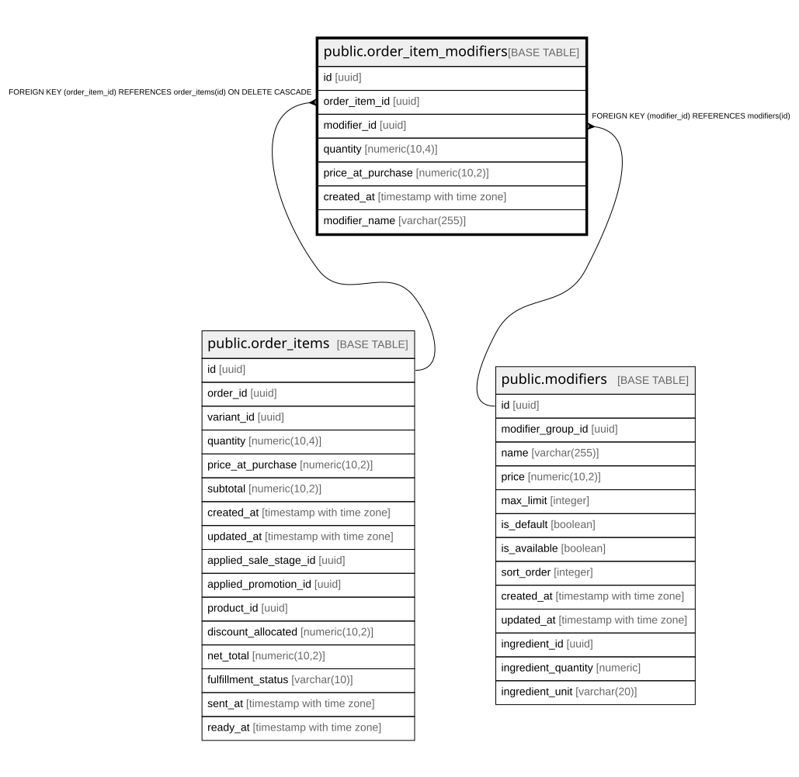

# public.order_item_modifiers

## Description

Modificadores seleccionados por el cliente en cada venta (histórico inmutable)

## Columns

| Name | Type | Default | Nullable | Children | Parents | Comment |
| ---- | ---- | ------- | -------- | -------- | ------- | ------- |
| id | uuid | gen_random_uuid() | false |  |  |  |
| order_item_id | uuid |  | false |  | [public.order_items](public.order_items.md) |  |
| modifier_id | uuid |  | false |  | [public.modifiers](public.modifiers.md) |  |
| quantity | numeric(10,4) | 1 | true |  |  | Quantity of this modifier applied. NUMERIC(10,4) supports fractional quantities like 0.5 portions. |
| price_at_purchase | numeric(10,2) |  | false |  |  | Precio del modificador al momento de la compra (snapshot histórico) |
| created_at | timestamp with time zone | now() | true |  |  |  |
| modifier_name | varchar(255) |  | true |  |  |  |

## Constraints

| Name | Type | Definition |
| ---- | ---- | ---------- |
| check_order_modifier_price_positive | CHECK | CHECK ((price_at_purchase >= (0)::numeric)) |
| check_order_modifier_quantity_positive | CHECK | CHECK ((quantity > (0)::numeric)) |
| order_item_modifiers_modifier_id_fkey | FOREIGN KEY | FOREIGN KEY (modifier_id) REFERENCES modifiers(id) |
| order_item_modifiers_pkey | PRIMARY KEY | PRIMARY KEY (id) |
| order_item_modifiers_order_item_id_fkey | FOREIGN KEY | FOREIGN KEY (order_item_id) REFERENCES order_items(id) ON DELETE CASCADE |

## Indexes

| Name | Definition |
| ---- | ---------- |
| order_item_modifiers_pkey | CREATE UNIQUE INDEX order_item_modifiers_pkey ON public.order_item_modifiers USING btree (id) |
| idx_order_item_modifiers_created | CREATE INDEX idx_order_item_modifiers_created ON public.order_item_modifiers USING btree (created_at DESC) |
| idx_order_item_modifiers_item | CREATE INDEX idx_order_item_modifiers_item ON public.order_item_modifiers USING btree (order_item_id) |
| idx_order_item_modifiers_modifier | CREATE INDEX idx_order_item_modifiers_modifier ON public.order_item_modifiers USING btree (modifier_id) |

## Relations

---

> Generated by [tbls](https://github.com/k1LoW/tbls)
