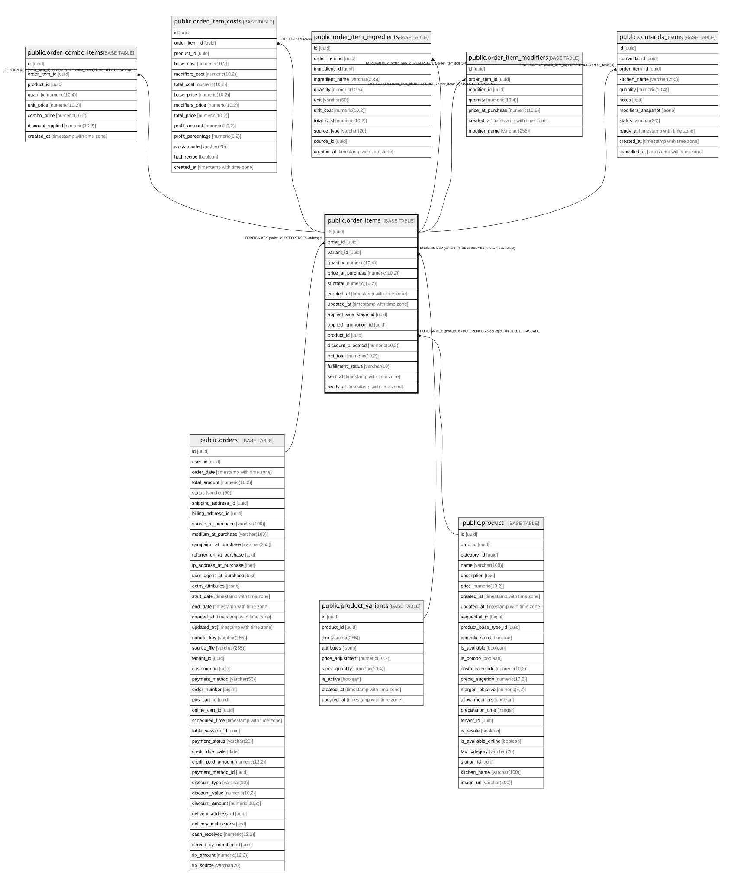

# public.order_items

## Columns

| Name | Type | Default | Nullable | Children | Parents | Comment |
| ---- | ---- | ------- | -------- | -------- | ------- | ------- |
| id | uuid | gen_random_uuid() | false | [public.order_combo_items](public.order_combo_items.md) [public.order_item_costs](public.order_item_costs.md) [public.order_item_ingredients](public.order_item_ingredients.md) [public.order_item_modifiers](public.order_item_modifiers.md) [public.comanda_items](public.comanda_items.md) |  |  |
| order_id | uuid |  | false |  | [public.orders](public.orders.md) |  |
| variant_id | uuid |  | true |  | [public.product_variants](public.product_variants.md) |  |
| quantity | numeric(10,4) |  | false |  |  | Quantity ordered of this item. NUMERIC(10,4) supports fractional quantities like 0.5kg. |
| price_at_purchase | numeric(10,2) |  | false |  |  |  |
| subtotal | numeric(10,2) |  | false |  |  |  |
| created_at | timestamp with time zone | now() | false |  |  |  |
| updated_at | timestamp with time zone | now() | false |  |  |  |
| applied_sale_stage_id | uuid |  | true |  |  |  |
| applied_promotion_id | uuid |  | true |  |  |  |
| product_id | uuid |  | true |  | [public.product](public.product.md) |  |
| discount_allocated | numeric(10,2) |  | true |  |  |  |
| net_total | numeric(10,2) |  | true |  |  |  |
| fulfillment_status | varchar(10) | 'new'::character varying | false |  |  |  |
| sent_at | timestamp with time zone |  | true |  |  |  |
| ready_at | timestamp with time zone |  | true |  |  |  |

## Constraints

| Name | Type | Definition |
| ---- | ---- | ---------- |
| chk_order_item_fulfillment | CHECK | CHECK (((fulfillment_status)::text = ANY ((ARRAY['new'::character varying, 'hold'::character varying, 'sent'::character varying, 'preparing'::character varying, 'ready'::character varying, 'cancelled'::character varying])::text[]))) |
| chk_variant_or_product | CHECK | CHECK (((variant_id IS NOT NULL) OR (product_id IS NOT NULL))) |
| order_items_order_id_variant_id_key | UNIQUE | UNIQUE (order_id, variant_id) |
| order_items_pkey | PRIMARY KEY | PRIMARY KEY (id) |
| order_items_order_id_fkey | FOREIGN KEY | FOREIGN KEY (order_id) REFERENCES orders(id) |
| order_items_product_id_fkey | FOREIGN KEY | FOREIGN KEY (product_id) REFERENCES product(id) ON DELETE CASCADE |
| order_items_variant_id_fkey | FOREIGN KEY | FOREIGN KEY (variant_id) REFERENCES product_variants(id) |

## Indexes

| Name | Definition |
| ---- | ---------- |
| order_items_order_id_variant_id_key | CREATE UNIQUE INDEX order_items_order_id_variant_id_key ON public.order_items USING btree (order_id, variant_id) |
| order_items_pkey | CREATE UNIQUE INDEX order_items_pkey ON public.order_items USING btree (id) |
| idx_order_items_order_id | CREATE INDEX idx_order_items_order_id ON public.order_items USING btree (order_id) |
| idx_order_items_product_id | CREATE INDEX idx_order_items_product_id ON public.order_items USING btree (product_id) |
| idx_order_items_variant_id | CREATE INDEX idx_order_items_variant_id ON public.order_items USING btree (variant_id) |
| idx_order_items_fulfillment_new | CREATE INDEX idx_order_items_fulfillment_new ON public.order_items USING btree (fulfillment_status) WHERE ((fulfillment_status)::text = 'new'::text) |

## Relations

---

> Generated by [tbls](https://github.com/k1LoW/tbls)
