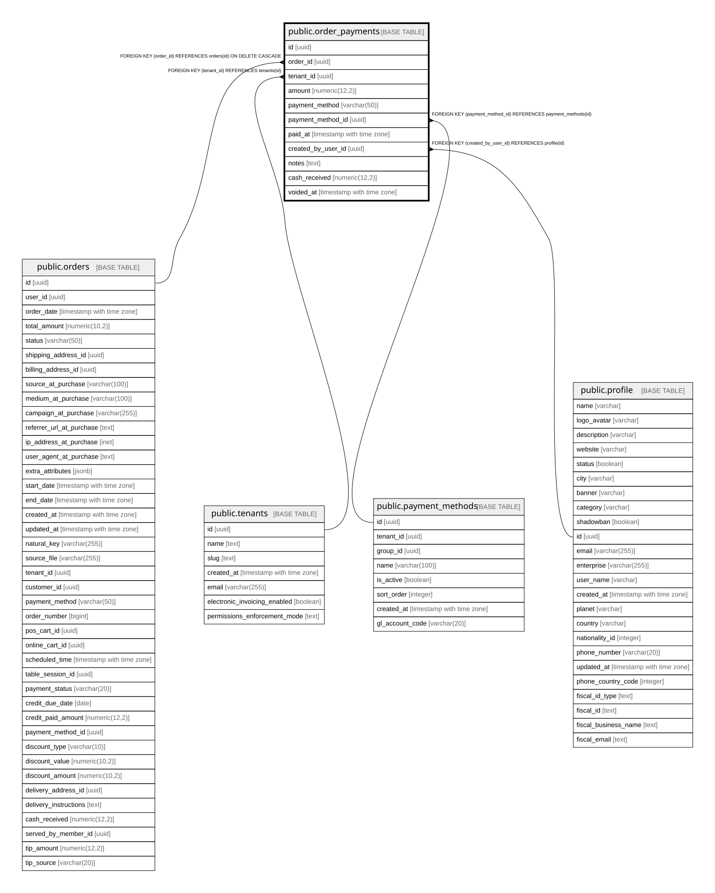

# public.order_payments

## Columns

| Name | Type | Default | Nullable | Children | Parents | Comment |
| ---- | ---- | ------- | -------- | -------- | ------- | ------- |
| id | uuid | gen_random_uuid() | false |  |  |  |
| order_id | uuid |  | false |  | [public.orders](public.orders.md) |  |
| tenant_id | uuid |  | false |  | [public.tenants](public.tenants.md) |  |
| amount | numeric(12,2) |  | false |  |  |  |
| payment_method | varchar(50) |  | true |  |  |  |
| payment_method_id | uuid |  | true |  | [public.payment_methods](public.payment_methods.md) |  |
| paid_at | timestamp with time zone | now() | false |  |  |  |
| created_by_user_id | uuid |  | true |  | [public.profile](public.profile.md) |  |
| notes | text |  | true |  |  |  |
| cash_received | numeric(12,2) |  | true |  |  | Cash handed over by the customer for this split payment line. Always NULL for non-cash methods. Change due is derived: cash_received - amount. |
| voided_at | timestamp with time zone |  | true |  |  | Soft-delete marker (warocol.com#649). NULL means active. When set, the row is excluded from paid_total computations and the parent order is reopened if this row had closed it. |

## Constraints

| Name | Type | Definition |
| ---- | ---- | ---------- |
| chk_order_payment_amount_positive | CHECK | CHECK ((amount > (0)::numeric)) |
| chk_order_payment_cash_received_gte_amount | CHECK | CHECK (((cash_received IS NULL) OR (cash_received >= amount))) |
| order_payments_order_id_fkey | FOREIGN KEY | FOREIGN KEY (order_id) REFERENCES orders(id) ON DELETE CASCADE |
| order_payments_created_by_user_id_fkey | FOREIGN KEY | FOREIGN KEY (created_by_user_id) REFERENCES profile(id) |
| order_payments_tenant_id_fkey | FOREIGN KEY | FOREIGN KEY (tenant_id) REFERENCES tenants(id) |
| order_payments_payment_method_id_fkey | FOREIGN KEY | FOREIGN KEY (payment_method_id) REFERENCES payment_methods(id) |
| order_payments_pkey | PRIMARY KEY | PRIMARY KEY (id) |

## Indexes

| Name | Definition |
| ---- | ---------- |
| order_payments_pkey | CREATE UNIQUE INDEX order_payments_pkey ON public.order_payments USING btree (id) |
| idx_order_payments_order_id | CREATE INDEX idx_order_payments_order_id ON public.order_payments USING btree (order_id) |
| idx_order_payments_tenant_date | CREATE INDEX idx_order_payments_tenant_date ON public.order_payments USING btree (tenant_id, paid_at) |
| idx_order_payments_method | CREATE INDEX idx_order_payments_method ON public.order_payments USING btree (payment_method) WHERE (payment_method IS NOT NULL) |
| idx_order_payments_active | CREATE INDEX idx_order_payments_active ON public.order_payments USING btree (order_id) WHERE (voided_at IS NULL) |

## Relations

---

> Generated by [tbls](https://github.com/k1LoW/tbls)
