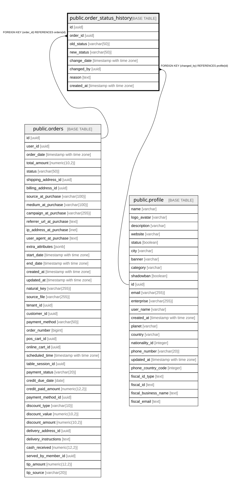

# public.order_status_history

## Columns

| Name | Type | Default | Nullable | Children | Parents | Comment |
| ---- | ---- | ------- | -------- | -------- | ------- | ------- |
| id | uuid | gen_random_uuid() | false |  |  |  |
| order_id | uuid |  | false |  | [public.orders](public.orders.md) |  |
| old_status | varchar(50) |  | true |  |  |  |
| new_status | varchar(50) |  | false |  |  |  |
| change_date | timestamp with time zone | now() | false |  |  |  |
| changed_by | uuid |  | true |  | [public.profile](public.profile.md) |  |
| reason | text |  | true |  |  |  |
| created_at | timestamp with time zone | now() | false |  |  |  |

## Constraints

| Name | Type | Definition |
| ---- | ---- | ---------- |
| order_status_history_pkey | PRIMARY KEY | PRIMARY KEY (id) |
| order_status_history_order_id_fkey | FOREIGN KEY | FOREIGN KEY (order_id) REFERENCES orders(id) |
| order_status_history_changed_by_fkey | FOREIGN KEY | FOREIGN KEY (changed_by) REFERENCES profile(id) |

## Indexes

| Name | Definition |
| ---- | ---------- |
| order_status_history_pkey | CREATE UNIQUE INDEX order_status_history_pkey ON public.order_status_history USING btree (id) |
| idx_order_status_history_change_date | CREATE INDEX idx_order_status_history_change_date ON public.order_status_history USING btree (change_date) |
| idx_order_status_history_order_id | CREATE INDEX idx_order_status_history_order_id ON public.order_status_history USING btree (order_id) |

## Relations

---

> Generated by [tbls](https://github.com/k1LoW/tbls)
