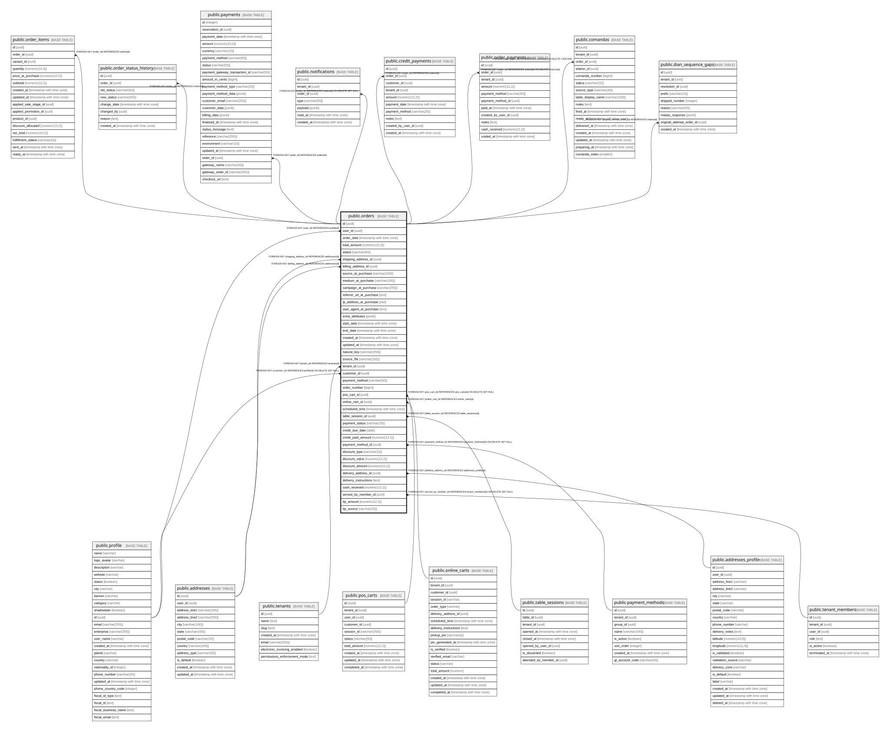

# public.orders

## Columns

| Name | Type | Default | Nullable | Children | Parents | Comment |
| ---- | ---- | ------- | -------- | -------- | ------- | ------- |
| id | uuid | gen_random_uuid() | false | [public.order_items](public.order_items.md) [public.order_status_history](public.order_status_history.md) [public.payments](public.payments.md) [public.notifications](public.notifications.md) [public.credit_payments](public.credit_payments.md) [public.order_payments](public.order_payments.md) [public.comandas](public.comandas.md) [public.dian_sequence_gaps](public.dian_sequence_gaps.md) |  |  |
| user_id | uuid |  | true |  | [public.profile](public.profile.md) |  |
| order_date | timestamp with time zone | now() | false |  |  |  |
| total_amount | numeric(10,2) |  | false |  |  |  |
| status | varchar(50) |  | false |  |  |  |
| shipping_address_id | uuid |  | true |  | [public.addresses](public.addresses.md) |  |
| billing_address_id | uuid |  | true |  | [public.addresses](public.addresses.md) |  |
| source_at_purchase | varchar(100) |  | true |  |  |  |
| medium_at_purchase | varchar(100) |  | true |  |  |  |
| campaign_at_purchase | varchar(255) |  | true |  |  |  |
| referrer_url_at_purchase | text |  | true |  |  |  |
| ip_address_at_purchase | inet |  | true |  |  |  |
| user_agent_at_purchase | text |  | true |  |  |  |
| extra_attributes | jsonb |  | true |  |  |  |
| start_date | timestamp with time zone |  | true |  |  |  |
| end_date | timestamp with time zone |  | true |  |  |  |
| created_at | timestamp with time zone | now() | false |  |  |  |
| updated_at | timestamp with time zone | now() | false |  |  |  |
| natural_key | varchar(255) |  | true |  |  |  |
| source_file | varchar(255) |  | true |  |  |  |
| tenant_id | uuid |  | true |  | [public.tenants](public.tenants.md) |  |
| customer_id | uuid |  | true |  | [public.profile](public.profile.md) |  |
| payment_method | varchar(50) |  | true |  |  |  |
| order_number | bigint | nextval('orders_order_number_seq'::regclass) | false |  |  |  |
| pos_cart_id | uuid |  | true |  | [public.pos_carts](public.pos_carts.md) |  |
| online_cart_id | uuid |  | true |  | [public.online_carts](public.online_carts.md) |  |
| scheduled_time | timestamp with time zone |  | true |  |  |  |
| table_session_id | uuid |  | true |  | [public.table_sessions](public.table_sessions.md) |  |
| payment_status | varchar(20) |  | true |  |  |  |
| credit_due_date | date |  | true |  |  |  |
| credit_paid_amount | numeric(12,2) | 0 | false |  |  |  |
| payment_method_id | uuid |  | true |  | [public.payment_methods](public.payment_methods.md) |  |
| discount_type | varchar(10) |  | true |  |  |  |
| discount_value | numeric(10,2) |  | true |  |  |  |
| discount_amount | numeric(10,2) |  | true |  |  |  |
| delivery_address_id | uuid |  | true |  | [public.addresses_profile](public.addresses_profile.md) |  |
| delivery_instructions | text |  | true |  |  |  |
| cash_received | numeric(12,2) |  | true |  |  | Cash handed over by the customer for the entire order, used only when the order has a single cash payment (no order_payments rows). Always NULL for split-mode orders or non-cash sales. Change due is derived: cash_received - total_amount. |
| served_by_member_id | uuid |  | true |  | [public.tenant_members](public.tenant_members.md) | Per-order waiter attribution (warocol.com#575). Used by bar/counter modes where mesa-level (#573) and session-level (#574) override do not fit. Resolver: order \> session \> table \> NULL. |
| tip_amount | numeric(12,2) | 0 | false |  |  | Tip captured at checkout in COP (warocol.com#635). Strictly separate from total_amount — never folded in. Attributed to served_by_member_id. |
| tip_source | varchar(20) | 'none'::character varying | false |  |  | How the tip was selected (warocol.com#635): preset (chip from tenant config), custom (free input), or none. Used for analytics. Must agree with tip_amount via chk_orders_tip_source_consistency. |
| tip_taxable | boolean | false | false |  |  | warocol.com#740 — whether IVA/INC was applied to tip_amount for this sale |
| tip_tax_amount | numeric(12,2) | 0 | false |  |  | warocol.com#740 — tax on tip_amount when tip_taxable=true; separate from total_amount |
| waros_redeemed | integer | 0 | false |  |  | api#370 — total WaRos spent |
| waro_redeemed_amount_cop | numeric(12,2) | 0 | false |  |  | api#370 — total COP discount from WaRo |

## Constraints

| Name | Type | Definition |
| ---- | ---- | ---------- |
| chk_orders_cash_received_gte_total | CHECK | CHECK (((cash_received IS NULL) OR (cash_received >= total_amount))) |
| chk_orders_tip_amount_nonneg | CHECK | CHECK ((tip_amount >= (0)::numeric)) |
| chk_orders_tip_source | CHECK | CHECK (((tip_source)::text = ANY ((ARRAY['preset'::character varying, 'custom'::character varying, 'none'::character varying])::text[]))) |
| chk_orders_tip_source_consistency | CHECK | CHECK ((((tip_amount = (0)::numeric) AND ((tip_source)::text = 'none'::text)) OR ((tip_amount > (0)::numeric) AND ((tip_source)::text = ANY ((ARRAY['preset'::character varying, 'custom'::character varying])::text[]))))) |
| chk_orders_tip_tax_amount_nonneg | CHECK | CHECK ((tip_tax_amount >= (0)::numeric)) |
| chk_orders_tip_tax_consistency | CHECK | CHECK ((((tip_amount = (0)::numeric) AND (tip_taxable = false) AND (tip_tax_amount = (0)::numeric)) OR (tip_amount > (0)::numeric))) |
| orders_billing_address_id_fkey | FOREIGN KEY | FOREIGN KEY (billing_address_id) REFERENCES addresses(id) |
| orders_shipping_address_id_fkey | FOREIGN KEY | FOREIGN KEY (shipping_address_id) REFERENCES addresses(id) |
| orders_natural_key_key | UNIQUE | UNIQUE (natural_key) |
| orders_pkey | PRIMARY KEY | PRIMARY KEY (id) |
| orders_pos_cart_id_fkey | FOREIGN KEY | FOREIGN KEY (pos_cart_id) REFERENCES pos_carts(id) ON DELETE SET NULL |
| orders_customer_id_fkey | FOREIGN KEY | FOREIGN KEY (customer_id) REFERENCES profile(id) ON DELETE SET NULL |
| orders_user_id_fkey | FOREIGN KEY | FOREIGN KEY (user_id) REFERENCES profile(id) |
| orders_served_by_member_id_fkey | FOREIGN KEY | FOREIGN KEY (served_by_member_id) REFERENCES tenant_members(id) ON DELETE SET NULL |
| orders_tenant_id_fkey | FOREIGN KEY | FOREIGN KEY (tenant_id) REFERENCES tenants(id) |
| orders_delivery_address_id_fkey | FOREIGN KEY | FOREIGN KEY (delivery_address_id) REFERENCES addresses_profile(id) |
| orders_online_cart_id_fkey | FOREIGN KEY | FOREIGN KEY (online_cart_id) REFERENCES online_carts(id) |
| orders_table_session_id_fkey | FOREIGN KEY | FOREIGN KEY (table_session_id) REFERENCES table_sessions(id) |
| orders_payment_method_id_fkey | FOREIGN KEY | FOREIGN KEY (payment_method_id) REFERENCES payment_methods(id) ON DELETE SET NULL |

## Indexes

| Name | Definition |
| ---- | ---------- |
| orders_natural_key_key | CREATE UNIQUE INDEX orders_natural_key_key ON public.orders USING btree (natural_key) |
| orders_pkey | CREATE UNIQUE INDEX orders_pkey ON public.orders USING btree (id) |
| idx_orders_customer_id | CREATE INDEX idx_orders_customer_id ON public.orders USING btree (customer_id) |
| idx_orders_natural_key | CREATE UNIQUE INDEX idx_orders_natural_key ON public.orders USING btree (natural_key) |
| idx_orders_order_date | CREATE INDEX idx_orders_order_date ON public.orders USING btree (order_date) |
| idx_orders_order_number | CREATE INDEX idx_orders_order_number ON public.orders USING btree (order_number) |
| idx_orders_pos_cart_id | CREATE INDEX idx_orders_pos_cart_id ON public.orders USING btree (pos_cart_id) |
| idx_orders_status | CREATE INDEX idx_orders_status ON public.orders USING btree (status) |
| idx_orders_tenant | CREATE INDEX idx_orders_tenant ON public.orders USING btree (tenant_id) |
| idx_orders_tenant_date | CREATE INDEX idx_orders_tenant_date ON public.orders USING btree (tenant_id, order_date DESC) |
| idx_orders_user_id | CREATE INDEX idx_orders_user_id ON public.orders USING btree (user_id) |
| idx_orders_tenant_bogota_date | CREATE INDEX idx_orders_tenant_bogota_date ON public.orders USING btree (tenant_id, date((order_date AT TIME ZONE 'America/Bogota'::text))) WHERE (pos_cart_id IS NOT NULL) |
| idx_orders_table_session | CREATE INDEX idx_orders_table_session ON public.orders USING btree (table_session_id) |
| idx_orders_payment_status | CREATE INDEX idx_orders_payment_status ON public.orders USING btree (tenant_id, payment_status) WHERE ((payment_status)::text = ANY ((ARRAY['credit'::character varying, 'partial'::character varying])::text[])) |
| idx_orders_pm_id | CREATE INDEX idx_orders_pm_id ON public.orders USING btree (payment_method_id) WHERE (payment_method_id IS NOT NULL) |
| idx_orders_delivery_address_id | CREATE INDEX idx_orders_delivery_address_id ON public.orders USING btree (delivery_address_id) WHERE (delivery_address_id IS NOT NULL) |
| idx_orders_served_by_member | CREATE INDEX idx_orders_served_by_member ON public.orders USING btree (served_by_member_id) WHERE (served_by_member_id IS NOT NULL) |

## Relations

---

> Generated by [tbls](https://github.com/k1LoW/tbls)
