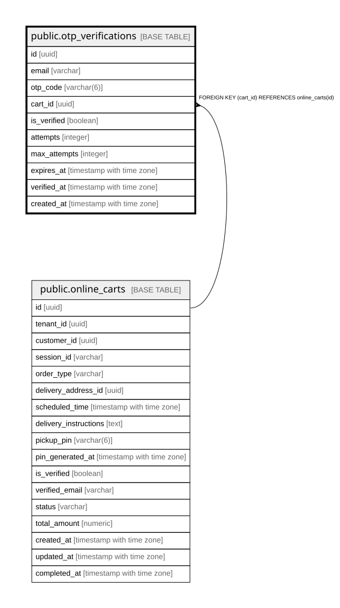

# public.otp_verifications

## Columns

| Name | Type | Default | Nullable | Children | Parents | Comment |
| ---- | ---- | ------- | -------- | -------- | ------- | ------- |
| id | uuid | gen_random_uuid() | false |  |  |  |
| email | varchar |  | false |  |  |  |
| otp_code | varchar(6) |  | false |  |  |  |
| cart_id | uuid |  | true |  | [public.online_carts](public.online_carts.md) |  |
| is_verified | boolean | false | true |  |  |  |
| attempts | integer | 0 | true |  |  |  |
| max_attempts | integer | 3 | true |  |  |  |
| expires_at | timestamp with time zone |  | false |  |  |  |
| verified_at | timestamp with time zone |  | true |  |  |  |
| created_at | timestamp with time zone | now() | true |  |  |  |

## Constraints

| Name | Type | Definition |
| ---- | ---- | ---------- |
| otp_verifications_cart_id_fkey | FOREIGN KEY | FOREIGN KEY (cart_id) REFERENCES online_carts(id) |
| otp_verifications_pkey | PRIMARY KEY | PRIMARY KEY (id) |

## Indexes

| Name | Definition |
| ---- | ---------- |
| otp_verifications_pkey | CREATE UNIQUE INDEX otp_verifications_pkey ON public.otp_verifications USING btree (id) |
| idx_otp_email | CREATE INDEX idx_otp_email ON public.otp_verifications USING btree (email) |
| idx_otp_cart | CREATE INDEX idx_otp_cart ON public.otp_verifications USING btree (cart_id) |
| idx_otp_expires | CREATE INDEX idx_otp_expires ON public.otp_verifications USING btree (expires_at) |

## Relations

---

> Generated by [tbls](https://github.com/k1LoW/tbls)
