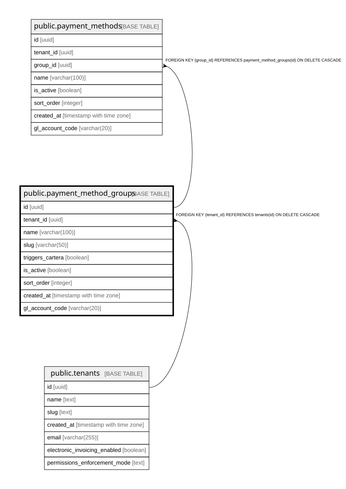

# public.payment_method_groups

## Columns

| Name | Type | Default | Nullable | Children | Parents | Comment |
| ---- | ---- | ------- | -------- | -------- | ------- | ------- |
| id | uuid | gen_random_uuid() | false | [public.payment_methods](public.payment_methods.md) |  |  |
| tenant_id | uuid |  | true |  | [public.tenants](public.tenants.md) |  |
| name | varchar(100) |  | false |  |  |  |
| slug | varchar(50) |  | false |  |  |  |
| triggers_cartera | boolean | false | false |  |  |  |
| is_active | boolean | true | false |  |  |  |
| sort_order | integer | 0 | false |  |  |  |
| created_at | timestamp with time zone | now() | false |  |  |  |
| gl_account_code | varchar(20) | NULL::character varying | true |  |  |  |

## Constraints

| Name | Type | Definition |
| ---- | ---- | ---------- |
| payment_method_groups_tenant_id_fkey | FOREIGN KEY | FOREIGN KEY (tenant_id) REFERENCES tenants(id) ON DELETE CASCADE |
| payment_method_groups_pkey | PRIMARY KEY | PRIMARY KEY (id) |

## Indexes

| Name | Definition |
| ---- | ---------- |
| payment_method_groups_pkey | CREATE UNIQUE INDEX payment_method_groups_pkey ON public.payment_method_groups USING btree (id) |
| idx_pmg_global_slug | CREATE UNIQUE INDEX idx_pmg_global_slug ON public.payment_method_groups USING btree (slug) WHERE (tenant_id IS NULL) |
| idx_pmg_tenant_slug | CREATE UNIQUE INDEX idx_pmg_tenant_slug ON public.payment_method_groups USING btree (tenant_id, slug) WHERE (tenant_id IS NOT NULL) |
| idx_pmg_tenant | CREATE INDEX idx_pmg_tenant ON public.payment_method_groups USING btree (tenant_id) |

## Relations

---

> Generated by [tbls](https://github.com/k1LoW/tbls)
