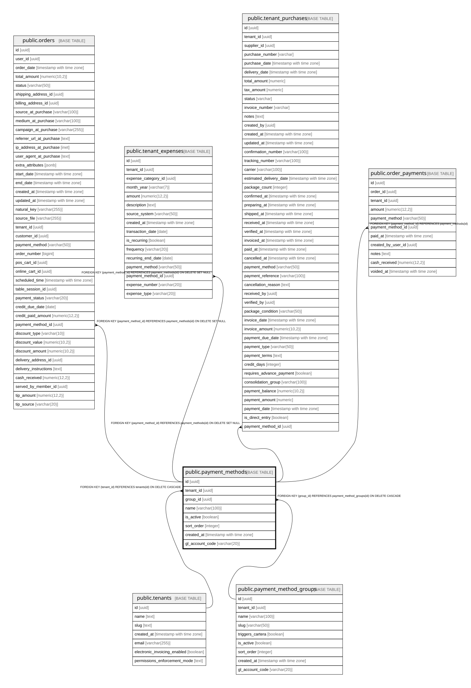

# public.payment_methods

## Columns

| Name | Type | Default | Nullable | Children | Parents | Comment |
| ---- | ---- | ------- | -------- | -------- | ------- | ------- |
| id | uuid | gen_random_uuid() | false | [public.orders](public.orders.md) [public.tenant_expenses](public.tenant_expenses.md) [public.tenant_purchases](public.tenant_purchases.md) [public.order_payments](public.order_payments.md) [public.table_qr_requests](public.table_qr_requests.md) |  |  |
| tenant_id | uuid |  | false |  | [public.tenants](public.tenants.md) |  |
| group_id | uuid |  | false |  | [public.payment_method_groups](public.payment_method_groups.md) |  |
| name | varchar(100) |  | false |  |  |  |
| is_active | boolean | true | false |  |  |  |
| sort_order | integer | 0 | false |  |  |  |
| created_at | timestamp with time zone | now() | false |  |  |  |
| gl_account_code | varchar(20) | NULL::character varying | true |  |  |  |

## Constraints

| Name | Type | Definition |
| ---- | ---- | ---------- |
| payment_methods_tenant_id_fkey | FOREIGN KEY | FOREIGN KEY (tenant_id) REFERENCES tenants(id) ON DELETE CASCADE |
| payment_methods_group_id_fkey | FOREIGN KEY | FOREIGN KEY (group_id) REFERENCES payment_method_groups(id) ON DELETE CASCADE |
| payment_methods_pkey | PRIMARY KEY | PRIMARY KEY (id) |

## Indexes

| Name | Definition |
| ---- | ---------- |
| payment_methods_pkey | CREATE UNIQUE INDEX payment_methods_pkey ON public.payment_methods USING btree (id) |
| idx_pm_tenant_group_name | CREATE UNIQUE INDEX idx_pm_tenant_group_name ON public.payment_methods USING btree (tenant_id, group_id, name) |
| idx_pm_group | CREATE INDEX idx_pm_group ON public.payment_methods USING btree (group_id) |
| idx_pm_tenant | CREATE INDEX idx_pm_tenant ON public.payment_methods USING btree (tenant_id) |

## Relations

---

> Generated by [tbls](https://github.com/k1LoW/tbls)
