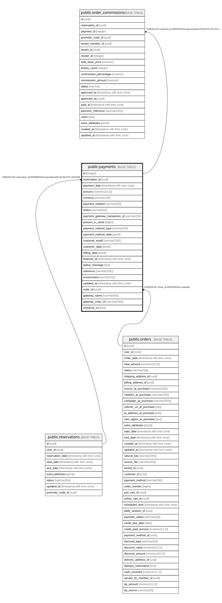

# public.payments

## Columns

| Name | Type | Default | Nullable | Children | Parents | Comment |
| ---- | ---- | ------- | -------- | -------- | ------- | ------- |
| id | integer | nextval('payments_id_seq'::regclass) | false | [public.order_commissions](public.order_commissions.md) |  |  |
| reservation_id | uuid |  | true |  | [public.reservations](public.reservations.md) |  |
| payment_date | timestamp with time zone | CURRENT_TIMESTAMP | true |  |  |  |
| amount | numeric(10,2) |  | false |  |  |  |
| currency | varchar(10) | 'USD'::character varying | true |  |  |  |
| payment_method | varchar(50) |  | true |  |  |  |
| status | varchar(50) | 'pending'::character varying | true |  |  |  |
| payment_gateway_transaction_id | varchar(50) |  | true |  |  |  |
| amount_in_cents | bigint |  | true |  |  |  |
| payment_method_type | varchar(20) |  | true |  |  |  |
| payment_method_data | jsonb |  | true |  |  |  |
| customer_email | varchar(255) |  | true |  |  |  |
| customer_data | jsonb |  | true |  |  |  |
| billing_data | jsonb |  | true |  |  |  |
| finalized_at | timestamp with time zone |  | true |  |  |  |
| status_message | text |  | true |  |  |  |
| reference | varchar(255) |  | true |  |  |  |
| environment | varchar(10) |  | true |  |  |  |
| updated_at | timestamp with time zone | CURRENT_TIMESTAMP | true |  |  |  |
| order_id | uuid |  | true |  | [public.orders](public.orders.md) |  |
| gateway_name | varchar(50) | 'wompi'::character varying | true |  |  | Payment gateway: bold, wompi, mercadopago |
| gateway_order_id | varchar(255) |  | true |  |  | Order ID from the payment gateway |
| checkout_url | text |  | true |  |  |  |

## Constraints

| Name | Type | Definition |
| ---- | ---- | ---------- |
| chk_payment_entity | CHECK | CHECK ((((order_id IS NOT NULL) AND (reservation_id IS NULL)) OR ((order_id IS NULL) AND (reservation_id IS NOT NULL)))) |
| payments_order_id_fkey | FOREIGN KEY | FOREIGN KEY (order_id) REFERENCES orders(id) |
| payments_pkey | PRIMARY KEY | PRIMARY KEY (id) |
| fk_reservation | FOREIGN KEY | FOREIGN KEY (reservation_id) REFERENCES reservations(id) ON DELETE CASCADE |

## Indexes

| Name | Definition |
| ---- | ---------- |
| payments_pkey | CREATE UNIQUE INDEX payments_pkey ON public.payments USING btree (id) |
| idx_payments_gateway_transaction_id | CREATE INDEX idx_payments_gateway_transaction_id ON public.payments USING btree (payment_gateway_transaction_id) |
| idx_payments_order_id | CREATE INDEX idx_payments_order_id ON public.payments USING btree (order_id) |

## Relations

---

> Generated by [tbls](https://github.com/k1LoW/tbls)
