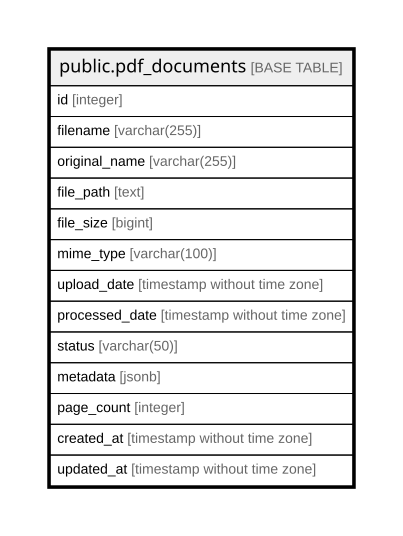

# public.pdf_documents

## Columns

| Name | Type | Default | Nullable | Children | Parents | Comment |
| ---- | ---- | ------- | -------- | -------- | ------- | ------- |
| id | integer | nextval('pdf_documents_id_seq'::regclass) | false |  |  |  |
| filename | varchar(255) |  | false |  |  |  |
| original_name | varchar(255) |  | false |  |  |  |
| file_path | text |  | true |  |  |  |
| file_size | bigint |  | true |  |  |  |
| mime_type | varchar(100) | 'application/pdf'::character varying | true |  |  |  |
| upload_date | timestamp without time zone | CURRENT_TIMESTAMP | true |  |  |  |
| processed_date | timestamp without time zone |  | true |  |  |  |
| status | varchar(50) | 'pending'::character varying | true |  |  |  |
| metadata | jsonb | '{}'::jsonb | true |  |  |  |
| page_count | integer |  | true |  |  |  |
| created_at | timestamp without time zone | CURRENT_TIMESTAMP | true |  |  |  |
| updated_at | timestamp without time zone | CURRENT_TIMESTAMP | true |  |  |  |

## Constraints

| Name | Type | Definition |
| ---- | ---- | ---------- |
| pdf_documents_pkey | PRIMARY KEY | PRIMARY KEY (id) |

## Indexes

| Name | Definition |
| ---- | ---------- |
| pdf_documents_pkey | CREATE UNIQUE INDEX pdf_documents_pkey ON public.pdf_documents USING btree (id) |
| idx_pdf_documents_status | CREATE INDEX idx_pdf_documents_status ON public.pdf_documents USING btree (status) |
| idx_pdf_documents_upload_date | CREATE INDEX idx_pdf_documents_upload_date ON public.pdf_documents USING btree (upload_date) |

## Relations

---

> Generated by [tbls](https://github.com/k1LoW/tbls)
