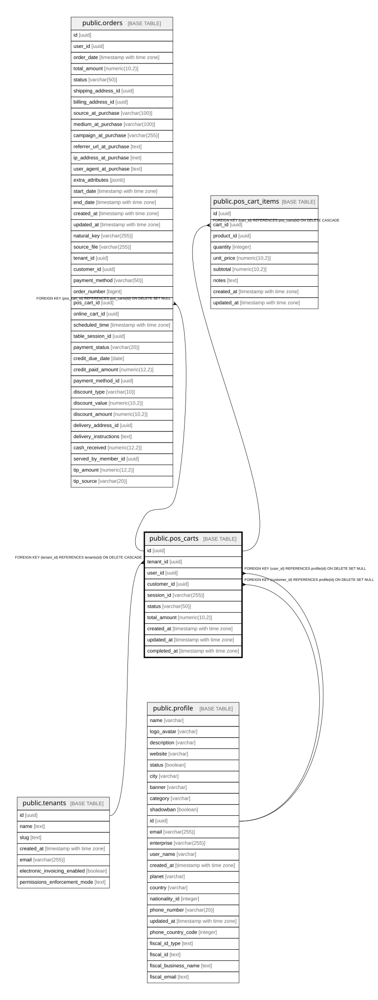

# public.pos_carts

## Columns

| Name | Type | Default | Nullable | Children | Parents | Comment |
| ---- | ---- | ------- | -------- | -------- | ------- | ------- |
| id | uuid | gen_random_uuid() | false | [public.orders](public.orders.md) [public.pos_cart_items](public.pos_cart_items.md) |  |  |
| tenant_id | uuid |  | false |  | [public.tenants](public.tenants.md) |  |
| user_id | uuid |  | true |  | [public.profile](public.profile.md) |  |
| customer_id | uuid |  | true |  | [public.profile](public.profile.md) |  |
| session_id | varchar(255) |  | true |  |  |  |
| status | varchar(50) | 'active'::character varying | false |  |  |  |
| total_amount | numeric(10,2) | 0 | true |  |  |  |
| created_at | timestamp with time zone | now() | true |  |  |  |
| updated_at | timestamp with time zone | now() | true |  |  |  |
| completed_at | timestamp with time zone |  | true |  |  |  |

## Constraints

| Name | Type | Definition |
| ---- | ---- | ---------- |
| pos_carts_pkey | PRIMARY KEY | PRIMARY KEY (id) |
| fk_pos_carts_customer | FOREIGN KEY | FOREIGN KEY (customer_id) REFERENCES profile(id) ON DELETE SET NULL |
| fk_pos_carts_user | FOREIGN KEY | FOREIGN KEY (user_id) REFERENCES profile(id) ON DELETE SET NULL |
| fk_pos_carts_tenant | FOREIGN KEY | FOREIGN KEY (tenant_id) REFERENCES tenants(id) ON DELETE CASCADE |

## Indexes

| Name | Definition |
| ---- | ---------- |
| pos_carts_pkey | CREATE UNIQUE INDEX pos_carts_pkey ON public.pos_carts USING btree (id) |
| idx_pos_carts_customer | CREATE INDEX idx_pos_carts_customer ON public.pos_carts USING btree (customer_id) WHERE ((status)::text = 'active'::text) |
| idx_pos_carts_session | CREATE INDEX idx_pos_carts_session ON public.pos_carts USING btree (session_id) WHERE ((status)::text = 'active'::text) |
| idx_pos_carts_tenant_status | CREATE INDEX idx_pos_carts_tenant_status ON public.pos_carts USING btree (tenant_id, status) |
| idx_pos_carts_user | CREATE INDEX idx_pos_carts_user ON public.pos_carts USING btree (user_id) WHERE ((status)::text = 'active'::text) |

## Triggers

| Name | Definition |
| ---- | ---------- |
| trigger_pos_carts_updated_at | CREATE TRIGGER trigger_pos_carts_updated_at BEFORE UPDATE ON public.pos_carts FOR EACH ROW EXECUTE FUNCTION update_pos_cart_updated_at() |

## Relations

---

> Generated by [tbls](https://github.com/k1LoW/tbls)
