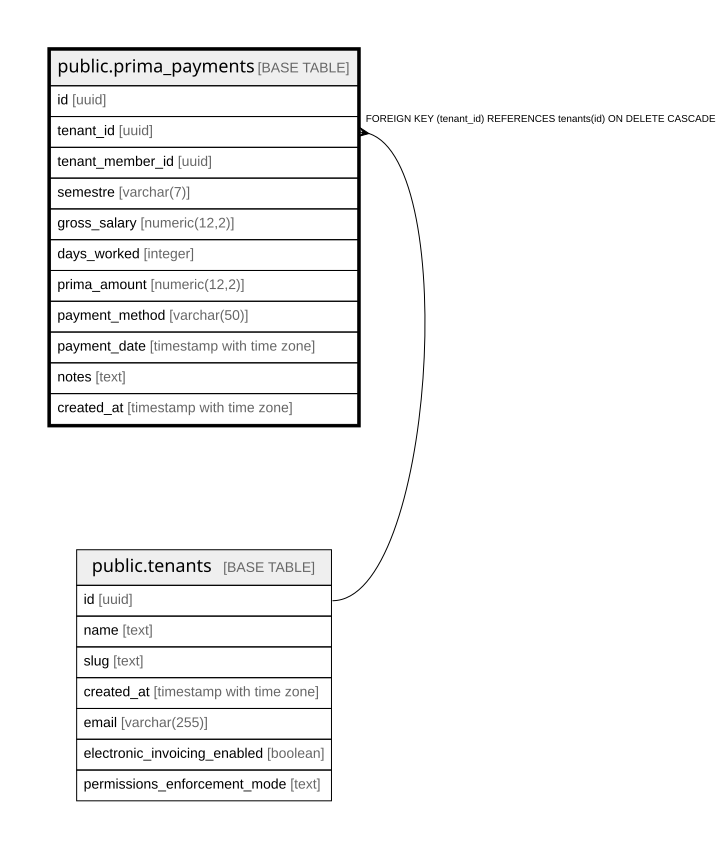

# public.prima_payments

## Columns

| Name | Type | Default | Nullable | Children | Parents | Comment |
| ---- | ---- | ------- | -------- | -------- | ------- | ------- |
| id | uuid | gen_random_uuid() | false |  |  |  |
| tenant_id | uuid |  | false |  | [public.tenants](public.tenants.md) |  |
| tenant_member_id | uuid |  | false |  |  |  |
| semestre | varchar(7) |  | false |  |  |  |
| gross_salary | numeric(12,2) |  | false |  |  |  |
| days_worked | integer | 180 | false |  |  |  |
| prima_amount | numeric(12,2) |  | false |  |  |  |
| payment_method | varchar(50) |  | true |  |  |  |
| payment_date | timestamp with time zone | now() | false |  |  |  |
| notes | text |  | true |  |  |  |
| created_at | timestamp with time zone | now() | false |  |  |  |

## Constraints

| Name | Type | Definition |
| ---- | ---- | ---------- |
| prima_payments_tenant_id_fkey | FOREIGN KEY | FOREIGN KEY (tenant_id) REFERENCES tenants(id) ON DELETE CASCADE |
| prima_payments_pkey | PRIMARY KEY | PRIMARY KEY (id) |

## Indexes

| Name | Definition |
| ---- | ---------- |
| prima_payments_pkey | CREATE UNIQUE INDEX prima_payments_pkey ON public.prima_payments USING btree (id) |
| ux_prima_payments_member_semestre | CREATE UNIQUE INDEX ux_prima_payments_member_semestre ON public.prima_payments USING btree (tenant_member_id, semestre) |
| ix_prima_payments_tenant | CREATE INDEX ix_prima_payments_tenant ON public.prima_payments USING btree (tenant_id) |

## Relations

---

> Generated by [tbls](https://github.com/k1LoW/tbls)
