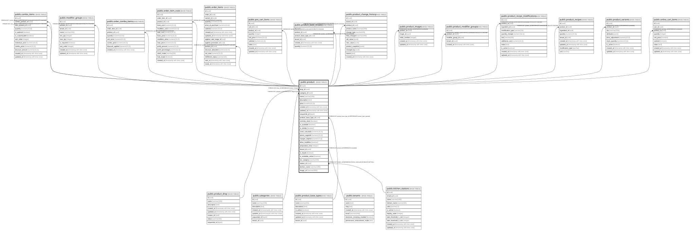

# public.product

## Columns

| Name | Type | Default | Nullable | Children | Parents | Comment |
| ---- | ---- | ------- | -------- | -------- | ------- | ------- |
| id | uuid | gen_random_uuid() | false | [public.combo_items](public.combo_items.md) [public.modifier_groups](public.modifier_groups.md) [public.order_combo_items](public.order_combo_items.md) [public.order_item_costs](public.order_item_costs.md) [public.order_items](public.order_items.md) [public.pos_cart_items](public.pos_cart_items.md) [public.product_base_recipes](public.product_base_recipes.md) [public.product_change_history](public.product_change_history.md) [public.product_images](public.product_images.md) [public.product_modifier_groups](public.product_modifier_groups.md) [public.product_recipe_modifications](public.product_recipe_modifications.md) [public.product_recipes](public.product_recipes.md) [public.product_variants](public.product_variants.md) [public.online_cart_items](public.online_cart_items.md) |  |  |
| drop_id | uuid |  | true |  | [public.product_drop](public.product_drop.md) |  |
| category_id | uuid |  | true |  | [public.categories](public.categories.md) |  |
| name | varchar(100) |  | false |  |  |  |
| description | text |  | true |  |  |  |
| price | numeric(10,2) |  | false |  |  |  |
| created_at | timestamp with time zone | now() | false |  |  |  |
| updated_at | timestamp with time zone | now() | false |  |  |  |
| sequential_id | bigint | nextval('product_sequential_id_seq'::regclass) | false |  |  |  |
| product_base_type_id | uuid |  | true |  | [public.product_base_types](public.product_base_types.md) | Referencia al tipo base del producto (BURGER, HOTDOG, etc.) - NULL para productos sin receta base |
| controla_stock | boolean | true | true |  |  | true = valida y descuenta inventario al vender, false = venta libre (solo calcula costo) |
| is_available | boolean | true | true |  |  |  |
| is_combo | boolean | false | true |  |  | true si es un combo/bundle de productos |
| costo_calculado | numeric(10,2) |  | true |  |  | Costo automático calculado desde recetas (se actualiza cuando cambian precios de ingredientes) |
| precio_sugerido | numeric(10,2) |  | true |  |  |  |
| margen_objetivo | numeric(5,2) |  | true |  |  | Margen de ganancia objetivo en porcentaje (ej: 150 = 150%) |
| allow_modifiers | boolean | true | true |  |  |  |
| preparation_time | integer |  | true |  |  |  |
| tenant_id | uuid |  | true |  | [public.tenants](public.tenants.md) |  |
| is_resale | boolean | false | true |  |  |  |
| is_available_online | boolean | true | true |  |  |  |
| tax_category | varchar(20) | 'standard'::character varying | false |  |  | Tax classification: standard (INC/IVA per tenant config), liquor (IVA licores 5%), exempt (no tax) |
| station_id | uuid |  | true |  | [public.kitchen_stations](public.kitchen_stations.md) |  |
| kitchen_name | varchar(100) |  | true |  |  |  |
| image_url | varchar(500) |  | true |  |  |  |

## Constraints

| Name | Type | Definition |
| ---- | ---- | ---------- |
| product_tax_category_check | CHECK | CHECK (((tax_category)::text = ANY ((ARRAY['standard'::character varying, 'liquor'::character varying, 'exempt'::character varying])::text[]))) |
| product_category_id_fkey | FOREIGN KEY | FOREIGN KEY (category_id) REFERENCES categories(id) |
| fk_product_base_type | FOREIGN KEY | FOREIGN KEY (product_base_type_id) REFERENCES product_base_types(id) |
| product_drop_id_fkey | FOREIGN KEY | FOREIGN KEY (drop_id) REFERENCES product_drop(id) |
| product_pkey | PRIMARY KEY | PRIMARY KEY (id) |
| product_tenant_id_fkey | FOREIGN KEY | FOREIGN KEY (tenant_id) REFERENCES tenants(id) |
| product_name_tenant_key | UNIQUE | UNIQUE (name, tenant_id) |
| product_station_id_fkey | FOREIGN KEY | FOREIGN KEY (station_id) REFERENCES kitchen_stations(id) ON DELETE SET NULL |

## Indexes

| Name | Definition |
| ---- | ---------- |
| product_pkey | CREATE UNIQUE INDEX product_pkey ON public.product USING btree (id) |
| idx_product_base_type | CREATE INDEX idx_product_base_type ON public.product USING btree (product_base_type_id) |
| idx_product_combo | CREATE INDEX idx_product_combo ON public.product USING btree (is_combo) WHERE (is_combo = true) |
| idx_product_controla_stock | CREATE INDEX idx_product_controla_stock ON public.product USING btree (controla_stock) |
| idx_product_is_available | CREATE INDEX idx_product_is_available ON public.product USING btree (is_available) |
| idx_product_tenant | CREATE INDEX idx_product_tenant ON public.product USING btree (tenant_id) |
| idx_product_available_online | CREATE INDEX idx_product_available_online ON public.product USING btree (tenant_id, is_available_online) |
| product_name_tenant_key | CREATE UNIQUE INDEX product_name_tenant_key ON public.product USING btree (name, tenant_id) |
| idx_product_station | CREATE INDEX idx_product_station ON public.product USING btree (station_id) WHERE (station_id IS NOT NULL) |

## Triggers

| Name | Definition |
| ---- | ---------- |
| trigger_update_product_timestamp | CREATE TRIGGER trigger_update_product_timestamp BEFORE UPDATE ON public.product FOR EACH ROW EXECUTE FUNCTION update_updated_at_column() |

## Relations

---

> Generated by [tbls](https://github.com/k1LoW/tbls)
