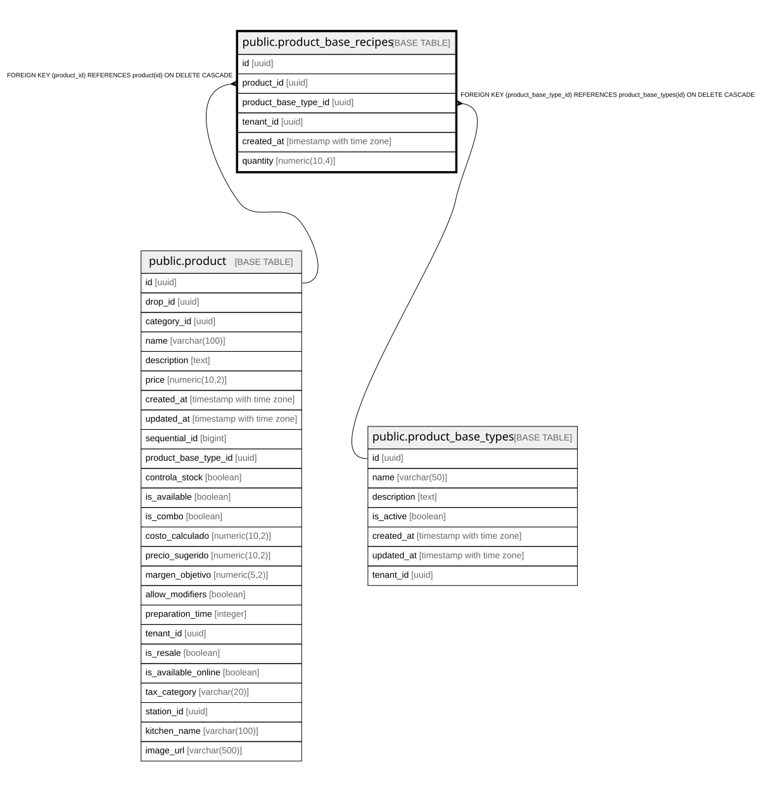

# public.product_base_recipes

## Description

Junction table linking products to multiple recipe bases

## Columns

| Name | Type | Default | Nullable | Children | Parents | Comment |
| ---- | ---- | ------- | -------- | -------- | ------- | ------- |
| id | uuid | gen_random_uuid() | false |  |  |  |
| product_id | uuid |  | false |  | [public.product](public.product.md) |  |
| product_base_type_id | uuid |  | false |  | [public.product_base_types](public.product_base_types.md) |  |
| tenant_id | uuid |  | false |  |  |  |
| created_at | timestamp with time zone | CURRENT_TIMESTAMP | true |  |  |  |
| quantity | numeric(10,4) | 1 | false |  |  | How many units of this recipe base the product consumes per order item. Multiplies brt.base_quantity in stock deduction and cost calculation. |

## Constraints

| Name | Type | Definition |
| ---- | ---- | ---------- |
| product_base_recipes_pkey | PRIMARY KEY | PRIMARY KEY (id) |
| product_base_recipes_product_id_product_base_type_id_tenant_key | UNIQUE | UNIQUE (product_id, product_base_type_id, tenant_id) |
| product_base_recipes_product_base_type_id_fkey | FOREIGN KEY | FOREIGN KEY (product_base_type_id) REFERENCES product_base_types(id) ON DELETE CASCADE |
| product_base_recipes_product_id_fkey | FOREIGN KEY | FOREIGN KEY (product_id) REFERENCES product(id) ON DELETE CASCADE |

## Indexes

| Name | Definition |
| ---- | ---------- |
| product_base_recipes_pkey | CREATE UNIQUE INDEX product_base_recipes_pkey ON public.product_base_recipes USING btree (id) |
| product_base_recipes_product_id_product_base_type_id_tenant_key | CREATE UNIQUE INDEX product_base_recipes_product_id_product_base_type_id_tenant_key ON public.product_base_recipes USING btree (product_id, product_base_type_id, tenant_id) |
| idx_product_base_recipes_base_type_id | CREATE INDEX idx_product_base_recipes_base_type_id ON public.product_base_recipes USING btree (product_base_type_id) |
| idx_product_base_recipes_product_id | CREATE INDEX idx_product_base_recipes_product_id ON public.product_base_recipes USING btree (product_id) |
| idx_product_base_recipes_tenant_id | CREATE INDEX idx_product_base_recipes_tenant_id ON public.product_base_recipes USING btree (tenant_id) |

## Relations

---

> Generated by [tbls](https://github.com/k1LoW/tbls)
