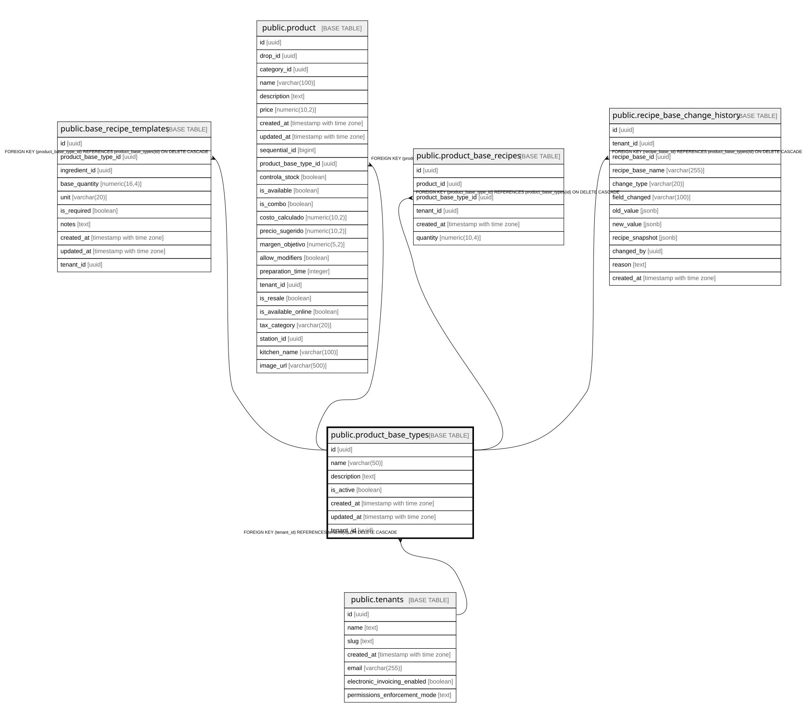

# public.product_base_types

## Description

Tipos base de productos para sistema de recetas modulares (ej: BURGER, HOTDOG)

## Columns

| Name | Type | Default | Nullable | Children | Parents | Comment |
| ---- | ---- | ------- | -------- | -------- | ------- | ------- |
| id | uuid | gen_random_uuid() | false | [public.base_recipe_templates](public.base_recipe_templates.md) [public.product](public.product.md) [public.product_base_recipes](public.product_base_recipes.md) [public.recipe_base_change_history](public.recipe_base_change_history.md) |  |  |
| name | varchar(50) |  | false |  |  | Nombre único del tipo base (BURGER, HOTDOG, PIZZA, etc.) |
| description | text |  | true |  |  |  |
| is_active | boolean | true | true |  |  |  |
| created_at | timestamp with time zone | now() | true |  |  |  |
| updated_at | timestamp with time zone | now() | true |  |  |  |
| tenant_id | uuid |  | true |  | [public.tenants](public.tenants.md) |  |

## Constraints

| Name | Type | Definition |
| ---- | ---- | ---------- |
| product_base_types_pkey | PRIMARY KEY | PRIMARY KEY (id) |
| product_base_types_tenant_id_fkey | FOREIGN KEY | FOREIGN KEY (tenant_id) REFERENCES tenants(id) ON DELETE CASCADE |
| product_base_types_name_tenant_key | UNIQUE | UNIQUE (name, tenant_id) |

## Indexes

| Name | Definition |
| ---- | ---------- |
| product_base_types_pkey | CREATE UNIQUE INDEX product_base_types_pkey ON public.product_base_types USING btree (id) |
| idx_product_base_types_tenant | CREATE INDEX idx_product_base_types_tenant ON public.product_base_types USING btree (tenant_id) |
| product_base_types_name_tenant_key | CREATE UNIQUE INDEX product_base_types_name_tenant_key ON public.product_base_types USING btree (name, tenant_id) |

## Relations

---

> Generated by [tbls](https://github.com/k1LoW/tbls)
