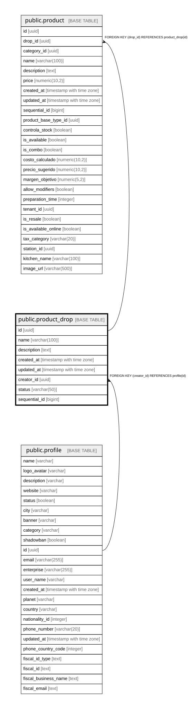

# public.product_drop

## Columns

| Name | Type | Default | Nullable | Children | Parents | Comment |
| ---- | ---- | ------- | -------- | -------- | ------- | ------- |
| id | uuid | gen_random_uuid() | false | [public.product](public.product.md) |  |  |
| name | varchar(100) |  | false |  |  |  |
| description | text |  | true |  |  |  |
| created_at | timestamp with time zone | now() | false |  |  |  |
| updated_at | timestamp with time zone | now() | false |  |  |  |
| creator_id | uuid |  | true |  | [public.profile](public.profile.md) |  |
| status | varchar(50) | 'active'::character varying | true |  |  |  |
| sequential_id | bigint | nextval('product_drop_sequential_id_seq'::regclass) | false |  |  |  |

## Constraints

| Name | Type | Definition |
| ---- | ---- | ---------- |
| product_drop_pkey | PRIMARY KEY | PRIMARY KEY (id) |
| fk_product_drop_profile | FOREIGN KEY | FOREIGN KEY (creator_id) REFERENCES profile(id) |

## Indexes

| Name | Definition |
| ---- | ---------- |
| product_drop_pkey | CREATE UNIQUE INDEX product_drop_pkey ON public.product_drop USING btree (id) |

## Relations

---

> Generated by [tbls](https://github.com/k1LoW/tbls)
