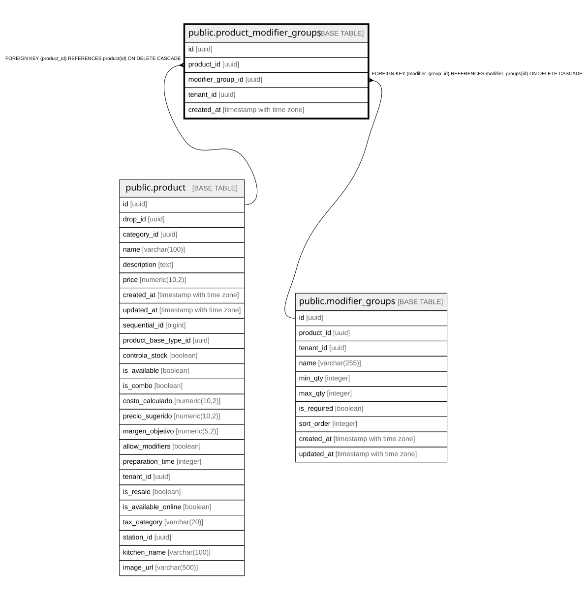

# public.product_modifier_groups

## Columns

| Name | Type | Default | Nullable | Children | Parents | Comment |
| ---- | ---- | ------- | -------- | -------- | ------- | ------- |
| id | uuid | gen_random_uuid() | false |  |  |  |
| product_id | uuid |  | false |  | [public.product](public.product.md) |  |
| modifier_group_id | uuid |  | false |  | [public.modifier_groups](public.modifier_groups.md) |  |
| tenant_id | uuid |  | false |  |  |  |
| created_at | timestamp with time zone | now() | true |  |  |  |

## Constraints

| Name | Type | Definition |
| ---- | ---- | ---------- |
| product_modifier_groups_modifier_group_id_fkey | FOREIGN KEY | FOREIGN KEY (modifier_group_id) REFERENCES modifier_groups(id) ON DELETE CASCADE |
| product_modifier_groups_pkey | PRIMARY KEY | PRIMARY KEY (id) |
| product_modifier_groups_product_id_modifier_group_id_key | UNIQUE | UNIQUE (product_id, modifier_group_id) |
| product_modifier_groups_product_id_fkey | FOREIGN KEY | FOREIGN KEY (product_id) REFERENCES product(id) ON DELETE CASCADE |

## Indexes

| Name | Definition |
| ---- | ---------- |
| product_modifier_groups_pkey | CREATE UNIQUE INDEX product_modifier_groups_pkey ON public.product_modifier_groups USING btree (id) |
| product_modifier_groups_product_id_modifier_group_id_key | CREATE UNIQUE INDEX product_modifier_groups_product_id_modifier_group_id_key ON public.product_modifier_groups USING btree (product_id, modifier_group_id) |
| idx_product_modifier_groups_modifier_group_id | CREATE INDEX idx_product_modifier_groups_modifier_group_id ON public.product_modifier_groups USING btree (modifier_group_id) |
| idx_product_modifier_groups_product_id | CREATE INDEX idx_product_modifier_groups_product_id ON public.product_modifier_groups USING btree (product_id) |
| idx_product_modifier_groups_tenant_id | CREATE INDEX idx_product_modifier_groups_tenant_id ON public.product_modifier_groups USING btree (tenant_id) |

## Relations

---

> Generated by [tbls](https://github.com/k1LoW/tbls)
