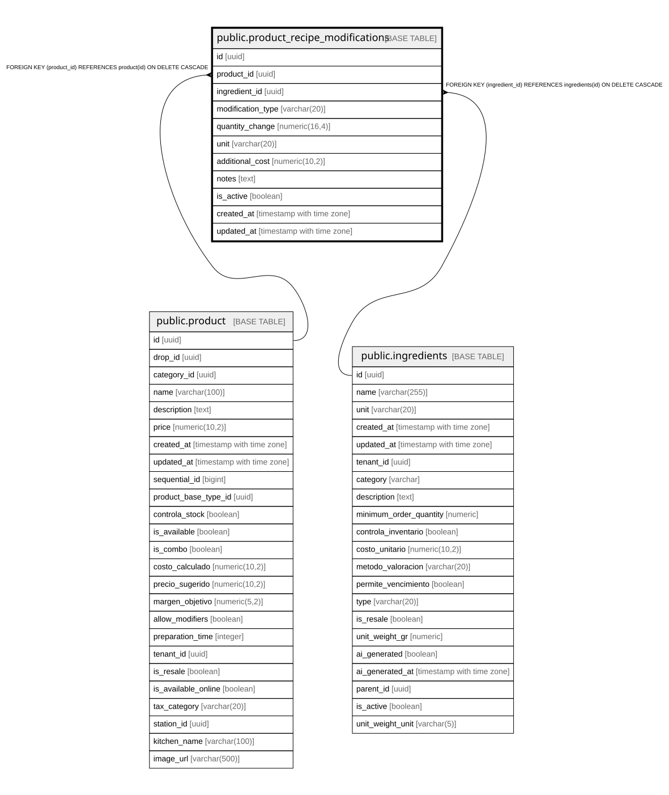

# public.product_recipe_modifications

## Description

Modificaciones específicas a la receta base para productos individuales

## Columns

| Name | Type | Default | Nullable | Children | Parents | Comment |
| ---- | ---- | ------- | -------- | -------- | ------- | ------- |
| id | uuid | gen_random_uuid() | false |  |  |  |
| product_id | uuid |  | false |  | [public.product](public.product.md) |  |
| ingredient_id | uuid |  | false |  | [public.ingredients](public.ingredients.md) |  |
| modification_type | varchar(20) |  | false |  |  | Tipo de modificación: ADD (agregar nuevo), REMOVE (quitar), INCREASE/DECREASE (cambiar cantidad), REPLACE (reemplazar cantidad) |
| quantity_change | numeric(16,4) | 0 | true |  |  | Change in ingredient quantity. Can be positive or negative. NUMERIC(10,4) allows decimal adjustments. |
| unit | varchar(20) | 'gr'::character varying | true |  |  |  |
| additional_cost | numeric(10,2) | 0 | true |  |  | Costo adicional por la modificación (puede ser negativo para descuentos) |
| notes | text |  | true |  |  |  |
| is_active | boolean | true | true |  |  |  |
| created_at | timestamp with time zone | now() | true |  |  |  |
| updated_at | timestamp with time zone | now() | true |  |  |  |

## Constraints

| Name | Type | Definition |
| ---- | ---- | ---------- |
| product_recipe_modifications_modification_type_check | CHECK | CHECK (((modification_type)::text = ANY (ARRAY[('ADD'::character varying)::text, ('REMOVE'::character varying)::text, ('INCREASE'::character varying)::text, ('DECREASE'::character varying)::text, ('REPLACE'::character varying)::text]))) |
| product_recipe_modifications_ingredient_id_fkey | FOREIGN KEY | FOREIGN KEY (ingredient_id) REFERENCES ingredients(id) ON DELETE CASCADE |
| product_recipe_modifications_product_id_fkey | FOREIGN KEY | FOREIGN KEY (product_id) REFERENCES product(id) ON DELETE CASCADE |
| product_recipe_modifications_pkey | PRIMARY KEY | PRIMARY KEY (id) |

## Indexes

| Name | Definition |
| ---- | ---------- |
| product_recipe_modifications_pkey | CREATE UNIQUE INDEX product_recipe_modifications_pkey ON public.product_recipe_modifications USING btree (id) |
| idx_product_recipe_mods_ingredient | CREATE INDEX idx_product_recipe_mods_ingredient ON public.product_recipe_modifications USING btree (ingredient_id) |
| idx_product_recipe_mods_product | CREATE INDEX idx_product_recipe_mods_product ON public.product_recipe_modifications USING btree (product_id) |
| idx_product_recipe_mods_type | CREATE INDEX idx_product_recipe_mods_type ON public.product_recipe_modifications USING btree (modification_type) |

## Relations

---

> Generated by [tbls](https://github.com/k1LoW/tbls)
