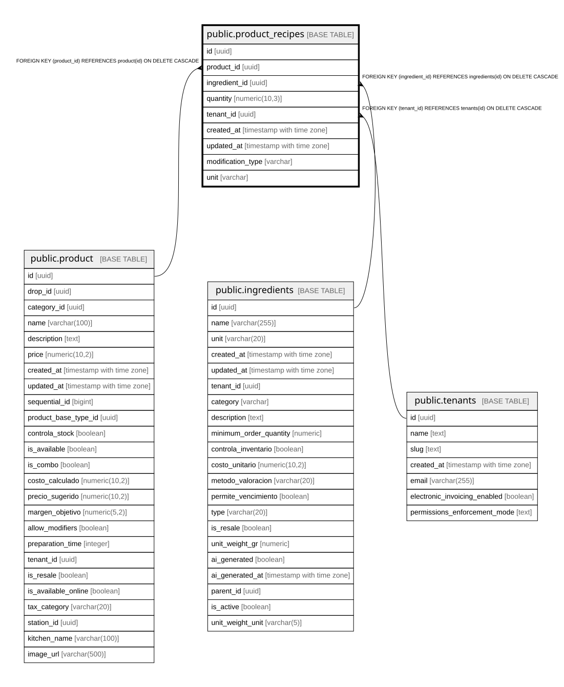

# public.product_recipes

## Columns

| Name | Type | Default | Nullable | Children | Parents | Comment |
| ---- | ---- | ------- | -------- | -------- | ------- | ------- |
| id | uuid | gen_random_uuid() | false |  |  |  |
| product_id | uuid |  | false |  | [public.product](public.product.md) |  |
| ingredient_id | uuid |  | false |  | [public.ingredients](public.ingredients.md) |  |
| quantity | numeric(10,3) |  | false |  |  | Cantidad necesaria del ingrediente (puede ser decimal, ej: 250.5g) |
| tenant_id | uuid |  | false |  | [public.tenants](public.tenants.md) |  |
| created_at | timestamp with time zone | now() | true |  |  |  |
| updated_at | timestamp with time zone | now() | true |  |  |  |
| modification_type | varchar | 'addition'::character varying | true |  |  | addition: nuevo ingrediente, override: reemplazar cantidad base, extra: sumar a cantidad base |
| unit | varchar |  | true |  |  | Unidad de medida para este ingrediente específico |

## Constraints

| Name | Type | Definition |
| ---- | ---- | ---------- |
| product_recipes_modification_type_check | CHECK | CHECK (((modification_type)::text = ANY (ARRAY[('addition'::character varying)::text, ('override'::character varying)::text, ('extra'::character varying)::text]))) |
| product_recipes_quantity_check | CHECK | CHECK ((quantity > (0)::numeric)) |
| product_recipes_ingredient_id_fkey | FOREIGN KEY | FOREIGN KEY (ingredient_id) REFERENCES ingredients(id) ON DELETE CASCADE |
| product_recipes_product_id_fkey | FOREIGN KEY | FOREIGN KEY (product_id) REFERENCES product(id) ON DELETE CASCADE |
| product_recipes_pkey | PRIMARY KEY | PRIMARY KEY (id) |
| product_recipes_tenant_id_fkey | FOREIGN KEY | FOREIGN KEY (tenant_id) REFERENCES tenants(id) ON DELETE CASCADE |
| unique_product_ingredient | UNIQUE | UNIQUE (product_id, ingredient_id) |

## Indexes

| Name | Definition |
| ---- | ---------- |
| product_recipes_pkey | CREATE UNIQUE INDEX product_recipes_pkey ON public.product_recipes USING btree (id) |
| unique_product_ingredient | CREATE UNIQUE INDEX unique_product_ingredient ON public.product_recipes USING btree (product_id, ingredient_id) |
| idx_product_recipes_ingredient_id | CREATE INDEX idx_product_recipes_ingredient_id ON public.product_recipes USING btree (ingredient_id) |
| idx_product_recipes_modification | CREATE INDEX idx_product_recipes_modification ON public.product_recipes USING btree (product_id, modification_type) |
| idx_product_recipes_product_id | CREATE INDEX idx_product_recipes_product_id ON public.product_recipes USING btree (product_id) |
| idx_product_recipes_tenant_id | CREATE INDEX idx_product_recipes_tenant_id ON public.product_recipes USING btree (tenant_id) |
| idx_product_recipes_tenant_ingredient | CREATE INDEX idx_product_recipes_tenant_ingredient ON public.product_recipes USING btree (tenant_id, ingredient_id) |

## Triggers

| Name | Definition |
| ---- | ---------- |
| update_product_recipes_updated_at | CREATE TRIGGER update_product_recipes_updated_at BEFORE UPDATE ON public.product_recipes FOR EACH ROW EXECUTE FUNCTION update_updated_at_column() |

## Relations

---

> Generated by [tbls](https://github.com/k1LoW/tbls)
