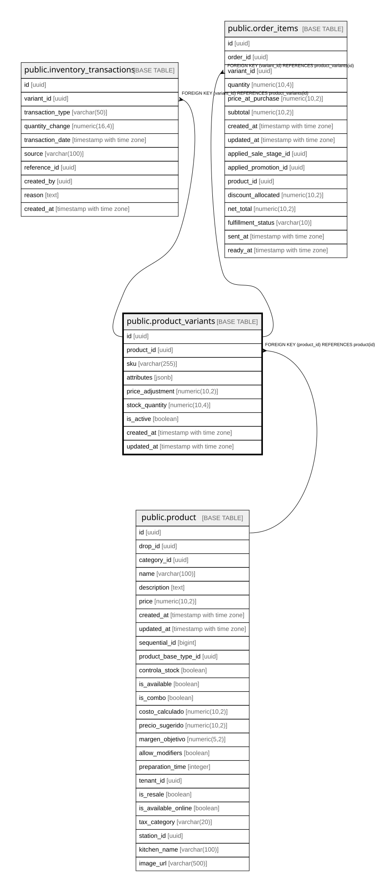

# public.product_variants

## Columns

| Name | Type | Default | Nullable | Children | Parents | Comment |
| ---- | ---- | ------- | -------- | -------- | ------- | ------- |
| id | uuid | gen_random_uuid() | false | [public.inventory_transactions](public.inventory_transactions.md) [public.order_items](public.order_items.md) |  |  |
| product_id | uuid |  | false |  | [public.product](public.product.md) |  |
| sku | varchar(255) |  | false |  |  |  |
| attributes | jsonb |  | true |  |  |  |
| price_adjustment | numeric(10,2) | 0.00 | false |  |  |  |
| stock_quantity | numeric(10,4) | 0 | false |  |  | Current stock quantity for this variant. NUMERIC(10,4) supports fractional stock levels. |
| is_active | boolean | true | false |  |  |  |
| created_at | timestamp with time zone | now() | false |  |  |  |
| updated_at | timestamp with time zone | now() | false |  |  |  |

## Constraints

| Name | Type | Definition |
| ---- | ---- | ---------- |
| product_variants_product_id_fkey | FOREIGN KEY | FOREIGN KEY (product_id) REFERENCES product(id) |
| product_variants_pkey | PRIMARY KEY | PRIMARY KEY (id) |
| product_variants_sku_key | UNIQUE | UNIQUE (sku) |

## Indexes

| Name | Definition |
| ---- | ---------- |
| product_variants_pkey | CREATE UNIQUE INDEX product_variants_pkey ON public.product_variants USING btree (id) |
| product_variants_sku_key | CREATE UNIQUE INDEX product_variants_sku_key ON public.product_variants USING btree (sku) |
| idx_product_variants_product_id | CREATE INDEX idx_product_variants_product_id ON public.product_variants USING btree (product_id) |
| idx_product_variants_sku | CREATE INDEX idx_product_variants_sku ON public.product_variants USING btree (sku) |

## Relations

---

> Generated by [tbls](https://github.com/k1LoW/tbls)
