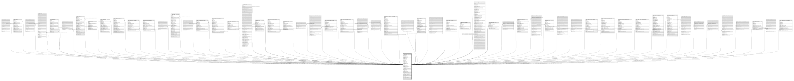

# public.profile

## Columns

| Name | Type | Default | Nullable | Children | Parents | Comment |
| ---- | ---- | ------- | -------- | -------- | ------- | ------- |
| name | varchar |  | true |  |  |  |
| logo_avatar | varchar |  | true |  |  |  |
| description | varchar |  | true |  |  |  |
| website | varchar |  | true |  |  |  |
| status | boolean |  | true |  |  |  |
| city | varchar |  | true |  |  |  |
| banner | varchar |  | true |  |  |  |
| category | varchar |  | true |  |  |  |
| shadowban | boolean |  | true |  |  |  |
| id | uuid | gen_random_uuid() | false | [public.sessions](public.sessions.md) [public.addresses](public.addresses.md) [public.api_tokens](public.api_tokens.md) [public.articles](public.articles.md) [public.campaign](public.campaign.md) [public.campaign_history](public.campaign_history.md) [public.clusters](public.clusters.md) [public.comments](public.comments.md) [public.daily_metrics](public.daily_metrics.md) [public.evaluation_results](public.evaluation_results.md) [public.gamification_modules](public.gamification_modules.md) [public.inventory_transactions](public.inventory_transactions.md) [public.lead_groups](public.lead_groups.md) [public.leads](public.leads.md) [public.magic_tokens](public.magic_tokens.md) [public.marketplace_purchases](public.marketplace_purchases.md) [public.modifier_change_history](public.modifier_change_history.md) [public.order_status_history](public.order_status_history.md) [public.orders](public.orders.md) [public.pos_carts](public.pos_carts.md) [public.product_change_history](public.product_change_history.md) [public.product_drop](public.product_drop.md) [public.profile_images](public.profile_images.md) [public.purchase_attachments](public.purchase_attachments.md) [public.purchase_status_history](public.purchase_status_history.md) [public.recipe_base_change_history](public.recipe_base_change_history.md) [public.reservation_units](public.reservation_units.md) [public.reservations](public.reservations.md) [public.supplier_payment_agreements](public.supplier_payment_agreements.md) [public.template_version_history](public.template_version_history.md) [public.templates](public.templates.md) [public.tenant_ingredient_movements](public.tenant_ingredient_movements.md) [public.tenant_invitations](public.tenant_invitations.md) [public.tenant_members](public.tenant_members.md) [public.tenant_purchases](public.tenant_purchases.md) [public.unit_transfer_log](public.unit_transfer_log.md) [public.user_achievements](public.user_achievements.md) [public.waros_transactions](public.waros_transactions.md) [public.waros_wallets](public.waros_wallets.md) [public.ticket_carts](public.ticket_carts.md) [public.salary_payments](public.salary_payments.md) [public.salary_attachments](public.salary_attachments.md) [public.expense_change_history](public.expense_change_history.md) [public.recurring_expense_instances](public.recurring_expense_instances.md) [public.salary_payment_change_history](public.salary_payment_change_history.md) [public.salary_config_change_history](public.salary_config_change_history.md) [public.order_commissions](public.order_commissions.md) [public.addresses_profile](public.addresses_profile.md) [public.online_carts](public.online_carts.md) [public.order_failures](public.order_failures.md) [public.customer_blacklist](public.customer_blacklist.md) [public.data_quality_alerts](public.data_quality_alerts.md) [public.waro_manual_assignments](public.waro_manual_assignments.md) [public.table_sessions](public.table_sessions.md) [public.order_payments](public.order_payments.md) [public.table_member_assignments](public.table_member_assignments.md) |  |  |
| email | varchar(255) |  | false |  |  |  |
| enterprise | varchar(255) |  | true |  |  |  |
| user_name | varchar |  | true |  |  |  |
| created_at | timestamp with time zone | CURRENT_TIMESTAMP | true |  |  |  |
| planet | varchar |  | true |  |  |  |
| country | varchar |  | true |  |  |  |
| nationality_id | integer |  | true |  |  |  |
| phone_number | varchar(20) |  | true |  |  |  |
| updated_at | timestamp with time zone | now() | true |  |  |  |
| phone_country_code | integer |  | true |  |  |  |
| fiscal_id_type | text |  | true |  |  |  |
| fiscal_id | text |  | true |  |  |  |
| fiscal_business_name | text |  | true |  |  |  |
| fiscal_email | text |  | true |  |  |  |

## Constraints

| Name | Type | Definition |
| ---- | ---- | ---------- |
| profile_email_key | UNIQUE | UNIQUE (email) |
| profile_pkey | PRIMARY KEY | PRIMARY KEY (id) |

## Indexes

| Name | Definition |
| ---- | ---------- |
| profile_email_key | CREATE UNIQUE INDEX profile_email_key ON public.profile USING btree (email) |
| profile_pkey | CREATE UNIQUE INDEX profile_pkey ON public.profile USING btree (id) |
| idx_profile_fiscal_id | CREATE INDEX idx_profile_fiscal_id ON public.profile USING btree (fiscal_id) WHERE (fiscal_id IS NOT NULL) |

## Relations

---

> Generated by [tbls](https://github.com/k1LoW/tbls)
