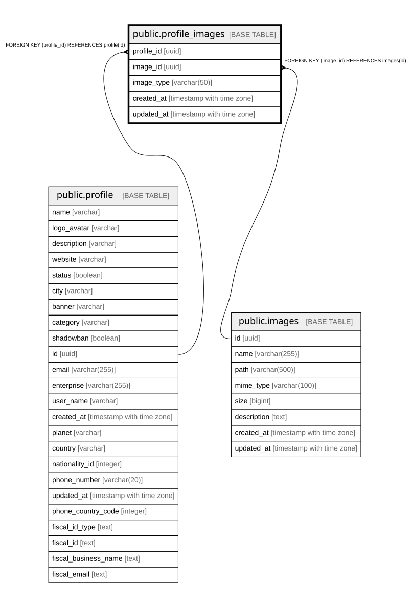

# public.profile_images

## Columns

| Name | Type | Default | Nullable | Children | Parents | Comment |
| ---- | ---- | ------- | -------- | -------- | ------- | ------- |
| profile_id | uuid |  | false |  | [public.profile](public.profile.md) |  |
| image_id | uuid |  | false |  | [public.images](public.images.md) |  |
| image_type | varchar(50) |  | false |  |  |  |
| created_at | timestamp with time zone | now() | false |  |  |  |
| updated_at | timestamp with time zone | now() | false |  |  |  |

## Constraints

| Name | Type | Definition |
| ---- | ---- | ---------- |
| profile_images_image_id_fkey | FOREIGN KEY | FOREIGN KEY (image_id) REFERENCES images(id) |
| profile_images_pkey | PRIMARY KEY | PRIMARY KEY (profile_id, image_id, image_type) |
| profile_images_profile_id_fkey | FOREIGN KEY | FOREIGN KEY (profile_id) REFERENCES profile(id) |

## Indexes

| Name | Definition |
| ---- | ---------- |
| profile_images_pkey | CREATE UNIQUE INDEX profile_images_pkey ON public.profile_images USING btree (profile_id, image_id, image_type) |

## Relations

---

> Generated by [tbls](https://github.com/k1LoW/tbls)
